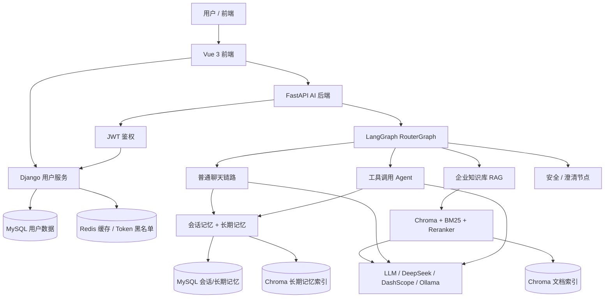

# NexusKB

NexusKB 是一个面向企业知识库场景的 RAG 智能问答系统。项目由 FastAPI AI 后端、Django 用户服务、Vue 前端和文档/评测体系组成，核心目标是把企业文档、会话上下文和用户长期偏好组织成可检索、可追溯、可扩展的知识助手能力。

它不是单纯的聊天 Demo，而是一套包含用户认证、会话记忆、企业知识检索、LangGraph 路由、向量数据库、重排序和前端交互的多服务 AI 应用框架。

## 项目定位

NexusKB 适合用于：

- 企业知识库问答与内部资料检索。
- RAG、混合检索、reranker 和 Agent 路由实验。
- 带用户体系和会话管理的 AI 助手原型。
- 多服务 AI 应用课程设计、毕业设计或作品集项目。
- 企业客服、知识助手、文档问答系统的工程验证。

## 核心能力

| 能力 | 说明 |
| --- | --- |
| 企业 RAG 问答 | 文档切分、向量化、Chroma 检索、BM25 混合召回、reranker 重排序和摘要生成。 |
| LangGraph Router | 根据用户请求在普通聊天、企业知识库、工具调用、安全/澄清节点之间路由。 |
| 会话记忆 | MySQL 保存会话历史，并用滚动摘要压缩较早上下文。 |
| 长期记忆 | 用户偏好、项目背景等长期事实写入 MySQL，并同步 Chroma 做语义召回。 |
| 用户体系 | Django 服务提供注册、登录、JWT、Token 刷新、用户信息和文件接口。 |
| 前端应用 | Vue 3 前端提供登录、注册、聊天、会话、个人中心和设置页面。 |
| 缓存与限流 | Redis 用于用户信息缓存、JWT 黑名单和 FastAPI 接口限流。 |
| 评测与实验 | 脚本支持企业 RAG 检索评测、延迟统计和策略对比。 |

## 总体架构



## 目录结构

```text
NexusKB-/
├── backend/                         # FastAPI AI 后端
│   ├── app/
│   │   ├── agent/                   # LangChain Agent、LangGraph Router、工具调用
│   │   ├── cache/                   # Redis 缓存封装
│   │   ├── config/                  # RAG、Chroma、Prompt、Agent YAML 配置
│   │   ├── core/                    # 统一响应、异常处理、限流、日志、性能记录
│   │   ├── db/                      # MySQL / Redis 连接
│   │   ├── models/                  # SQLAlchemy ORM 模型
│   │   ├── prompt/                  # Prompt 模板
│   │   ├── rag/                     # 文档入库、检索、重排序、企业 RAG 服务
│   │   ├── router/                  # FastAPI 路由与业务服务
│   │   ├── schemas/                 # Pydantic 请求/响应模型
│   │   ├── services/                # 会话记忆、长期记忆、会话管理
│   │   └── utils/                   # 配置、认证、文件、路径工具
│   ├── scripts/                     # 索引构建、模型下载、评测脚本
│   ├── tests/                       # 后端测试
│   ├── main.py                      # FastAPI 入口
│   └── requirements.txt
├── DjangoUserService/               # Django 用户与文件服务
│   ├── apps/                        # user / file / secret / utils 应用
│   ├── DjangoUserService/           # Django 项目配置
│   ├── manage.py
│   └── requirements.txt
├── front/                           # Vue 3 前端
│   ├── src/                         # 页面、路由、Pinia store、i18n、API 配置
│   ├── package.json
│   └── vite.config.js
├── docs/                            # 项目说明、架构文档、模块设计、部署和实验记录
├── requirements.txt                 # 聚合 Python 依赖
└── .gitignore                       # 忽略环境、缓存、数据、个人文档等本地文件
```

## 后端请求链路

```text
HTTP/SSE 请求
  -> FastAPI router/chat.py
  -> JWT 认证与限流
  -> ChatService 或 RouterGraph
  -> load_context：读取会话摘要、最近历史、长期记忆
  -> llm_router：判断 route / rag_intent / source_hints
  -> validate_decision：校验路由输出
  -> chat / enterprise_knowledge / tool_action / unsafe_or_system / clarify
  -> persist_message：写入会话历史、更新会话记忆、抽取长期记忆
  -> JSON 或 SSE 响应
```

## 记忆体系

NexusKB 当前采用三层记忆：

1. **Working Memory**：最近几轮原文，保证当前对话连贯。
2. **Session Memory**：当前会话较早历史的滚动摘要，降低上下文长度。
3. **Long-term Memory**：跨会话长期事实，例如用户偏好、项目背景、稳定约束。MySQL 是权威存储，Chroma 是语义召回索引。

长期记忆通过 `user_id` 和 `status=active` 做用户隔离。删除记忆时会先软删除 MySQL 记录，再尽力删除 Chroma 向量；即使向量删除失败，语义去重也会回查 MySQL，避免已删除记忆继续影响后续写入。

## 主要 API

| 接口 | 方法 | 用途 |
| --- | --- | --- |
| `/api/agent/query/stream` | POST | RouterGraph SSE 流式问答。 |
| `/api/agent/router/query` | POST | RouterGraph 非流式问答。 |
| `/api/rag/query` | POST | RAG 检索摘要。 |
| `/api/session/{session_id}` | GET / DELETE | 获取或删除当前用户会话。 |
| `/api/sessions/{user_id}` | GET | 获取当前用户会话列表，强制只能查自己。 |
| `/api/memories` | GET | 获取当前用户长期记忆。 |
| `/api/memories/{memory_id}` | DELETE | 删除当前用户长期记忆。 |
| `/api/vector/add/single` | POST | 上传单个文档入向量库。 |
| `/api/vector/add/multiple` | POST | 上传多个文档入向量库。 |
| `/api/vector/clean` | DELETE | 清空当前用户上传文档向量。 |
| `/api/reorder` | POST | 对候选文档重排序。 |

详细接口见 [backend/api.md](./backend/api.md)。

## 技术栈

### FastAPI AI 后端

- Python 3.11/3.12
- FastAPI / Starlette / Uvicorn
- LangChain / LangGraph
- Chroma / langchain-chroma
- SQLAlchemy / aiomysql
- Redis
- DeepSeek / DashScope / Ollama 兼容模型
- sentence-transformers / PyTorch reranker
- unstructured / pypdf / python-magic

### Django 用户服务

- Django / Django REST Framework
- Simple JWT
- MySQL
- Redis / Celery
- drf-yasg

### Vue 前端

- Vue 3 / Vite
- Vue Router
- Pinia
- Vant
- Axios
- Vue I18n
- marked / highlight.js / DOMPurify

## 本地运行

### 1. 准备基础服务

需要提前启动：

- MySQL
- Redis
- 可选：Ollama、Chroma 持久化目录、本地 reranker 模型

### 2. 安装 Python 依赖

项目可以使用聚合依赖：

```bash
pip install -r requirements.txt
```

也可以分别安装：

```bash
cd backend
pip install -r requirements.txt
```

```bash
cd DjangoUserService
pip install -r requirements.txt
```

Windows 下如果使用 `python-magic`，需要确保 `python-magic-bin` 安装成功，并且 `libmagic.dll` 所在目录能被当前环境找到。

### 3. 配置环境变量

复制示例文件，不要提交真实 `.env`：

```bash
cd backend
copy .env.example .env
```

```bash
cd DjangoUserService
copy .env.example .env
```

FastAPI 和 Django 的 JWT 相关密钥需要保持一致，否则 FastAPI 无法校验 Django 生成的 Token。

### 4. 启动服务

Django 用户服务：

```bash
cd DjangoUserService
python manage.py migrate
python manage.py runserver 8001
```

FastAPI AI 后端：

```bash
cd backend
uvicorn main:app --reload
```

Vue 前端：

```bash
cd front
npm install
npm run dev
```

## 验证命令

长期记忆与 RouterGraph 相关单测：

```bash
PYTHONPATH=backend pytest backend/tests/test_long_term_memory_unit.py -q
```

语法编译检查：

```bash
python -m compileall backend/app
```

完整 FastAPI app 导入检查：

```bash
PYTHONPATH=backend DEEPSEEK_API_KEY=test python -c "import main; print('IMPORT_OK')"
```

## GitHub 提交安全规则

不要提交以下内容：

- `.env`、`.env.local`、生产密钥、JWT 密钥、数据库密码、API Key。
- 虚拟环境、Conda 环境、`node_modules`、构建产物。
- 日志、缓存、数据库文件、Redis dump、Chroma 向量库目录。
- 原始企业数据、评测私有数据、大模型权重。
- 简历、PDF 简历、个人材料、临时面试材料或本地规划草稿。

仓库只保留源码、可公开说明文档、示例环境变量文件和可复现脚本。

## 文档入口

- [docs/README.md](./docs/README.md)：文档中心。
- [docs/PROJECT_OVERVIEW.md](./docs/PROJECT_OVERVIEW.md)：项目大纲与系统边界。
- [docs/modules/README.md](./docs/modules/README.md)：模块设计索引。
- [backend/BACKEND_SUMMARY.md](./backend/BACKEND_SUMMARY.md)：后端架构总结。
- [backend/api.md](./backend/api.md)：FastAPI 接口文档。
- [DjangoUserService/api.md](./DjangoUserService/api.md)：用户服务接口文档。

## 后续方向

- 完善端到端集成测试和容器化启动脚本。
- 将 API 文档从 OpenAPI 自动生成并同步到 Markdown。
- 扩展长期记忆的用户可编辑、冲突处理和审计能力。
- 优化企业 RAG 的 chunk 策略、召回融合和 reranker 延迟。
- 增强前端对引用来源、记忆管理和知识库上传状态的展示。
