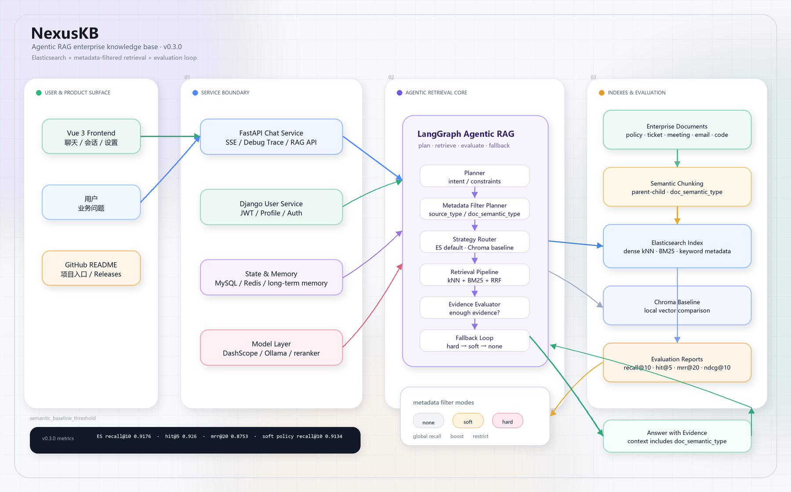

# NexusKB

NexusKB 是一个面向企业知识库场景的 RAG 智能问答系统。项目围绕“企业内部文档如何被可靠检索、组织、重排并用于回答问题”展开，整合了 FastAPI 问答服务、Django 用户服务、Vue 前端、MySQL 会话存储、Redis 缓存和 Chroma 向量检索。

与通用聊天应用不同，NexusKB 的重点不是单轮闲聊，而是企业文档问答链路：用户提出业务问题后，系统会从知识库中召回相关资料，结合会话上下文和重排序结果生成回答，并保留用户身份、会话历史和接口状态。

## 项目定位

NexusKB 适合用于：

- 企业知识库问答
- 内部制度、流程、产品资料检索
- RAG 检索与重排序实验
- 多服务 AI 应用课程设计或毕业设计
- 智能客服、知识助手原型验证

## 核心能力

- 企业知识问答：基于企业文档内容进行检索增强回答。
- RAG 检索链路：支持文档解析、文本切分、向量化、ChromaDB 索引和相似度召回。
- 检索结果重排序：支持本地 reranker 模型，对初步召回片段进行二次排序。
- 会话记忆：使用 MySQL 持久化聊天历史，支持多轮对话上下文。
- 长期记忆实验：新增长期记忆抽取、去重、向量召回和评估脚本，用于验证跨会话记忆效果。
- 用户体系：独立 Django 用户服务，提供注册、登录、JWT 鉴权、Token 刷新和用户信息接口。
- 前端应用：Vue 3 前端提供登录、注册、聊天、会话、个人中心和设置页面。
- 缓存与限流：Redis 用于用户信息缓存、Token 黑名单和接口限流。
- 观测与审计：补充性能日志、审计日志脱敏工具和长期记忆评测输出，便于定位检索、记忆和回答链路问题。
- 多模型接入：支持 DashScope 云端模型，也预留 Ollama、本地 embedding 和 reranker 模型配置。

## 架构概览



## 目录结构

```text
NexusKB/
├── backend/                 # FastAPI RAG 问答服务
│   ├── app/                 # 业务代码
│   │   ├── agent/           # Agent 与路由图
│   │   ├── cache/           # Redis 缓存封装
│   │   ├── config/          # RAG、Chroma、Prompt 配置
│   │   ├── db/              # MySQL / Redis 连接
│   │   ├── models/          # 会话数据模型
│   │   ├── rag/             # 检索、向量库、重排序
│   │   ├── router/          # FastAPI 路由
│   │   ├── services/        # 会话记忆等业务服务
│   │   └── utils/           # 通用工具
│   ├── scripts/             # 数据准备、索引构建和评测脚本
│   ├── main.py              # FastAPI 入口
│   └── requirements.txt
├── DjangoUserService/       # Django 用户服务
│   ├── apps/                # 用户、文件、工具模块
│   ├── DjangoUserService/   # Django 项目配置
│   ├── manage.py
│   └── requirements.txt
├── front/                   # Vue 3 前端
│   ├── src/
│   ├── package.json
│   └── vite.config.js
├── docs/                    # 项目文档、架构说明、实验记录和运维文档
│   ├── experiments/         # RAG 延迟优化、长期记忆评估等实验记录
│   ├── ops/                 # 部署、故障排除和模型配置说明
│   └── project_guide/       # 项目介绍、模块说明和架构图
├── start-dev.ps1            # Windows 本地开发一键启动脚本
├── requirements.txt         # Python 聚合依赖
└── .gitignore
```

## 技术栈

后端问答服务：

- Python 3.12+
- FastAPI
- Uvicorn
- LangChain
- LangGraph
- ChromaDB
- SQLAlchemy
- aiomysql
- Redis
- DashScope
- Ollama
- sentence-transformers
- ModelScope
- PyTorch
- unstructured

用户服务：

- Python 3.10+
- Django 5.2
- Django REST Framework
- Simple JWT
- PyMySQL / mysqlclient
- Celery
- django-redis
- drf-yasg

前端：

- Vue 3
- Vite
- Vue Router
- Pinia
- Vant
- Axios
- Vue I18n
- marked
- highlight.js
- DOMPurify

基础设施：

- MySQL
- Redis
- ChromaDB
- DashScope API
- 可选本地模型服务

## 安装环境

建议准备：

- Python 3.12+：运行 FastAPI 问答服务
- Python 3.10+：运行 Django 用户服务
- Node.js 16+
- npm 或 pnpm
- MySQL
- Redis
- Git

如果使用本地重排序模型，还需要准备 PyTorch 运行环境和足够的模型存储空间。

## 安装依赖

根目录提供了聚合依赖文件：

```bash
pip install -r requirements.txt
```

该文件会加载：

```text
-r backend/requirements.txt
-r DjangoUserService/requirements.txt
```

也可以分别安装：

```bash
cd backend
pip install -r requirements.txt
```

```bash
cd DjangoUserService
pip install -r requirements.txt
```

前端依赖：

```bash
cd front
npm install
```

或：

```bash
cd front
pnpm install
```

## 环境变量

FastAPI 服务：

```bash
cd backend
copy .env.example .env
```

需要配置 MySQL、Redis、JWT、DashScope 和 reranker 模型路径等参数。

Django 用户服务：

```bash
cd DjangoUserService
copy .env.example .env
```

需要配置数据库、Redis 和 `SECRET_KEY`。FastAPI 与 Django 的 JWT 密钥应保持一致，否则 FastAPI 无法校验 Django 生成的 Token。

## 启动服务

启动 MySQL 和 Redis 后，先启动用户服务：

```bash
cd DjangoUserService
python manage.py migrate
python manage.py runserver 8001
```

启动 FastAPI 问答服务：

```bash
cd backend
uvicorn main:app --reload
```

启动前端：

```bash
cd front
npm run dev
```

Windows 本地开发也可以使用根目录脚本同时拉起 Redis、Django、FastAPI 和前端：

```powershell
.\start-dev.ps1 -Migrate
```

默认使用 `NexusKB` conda 环境；如果想使用 `.venv` 或 PATH 中的 Python，可以传入 `-CondaEnv ''`。

## 数据说明

本项目使用企业知识库类数据进行 RAG 检索实验，重点关注企业文档、问题集、知识片段和检索评测结果。仓库不会直接提交原始数据、生成后的向量库或本地运行缓存。

本地运行时通常需要准备：

- 企业知识文档
- 问题集或评测集
- ChromaDB 索引目录
- 可选 reranker 模型权重

相关配置位于：

```text
backend/app/config/chroma.yaml
backend/app/config/rag.yaml
```

相关脚本位于：

```text
backend/scripts/
```

其中企业 RAG parent-child 索引默认使用：

```text
backend/data/enterprise_rag_bench/child_chunks_parent_child.jsonl
backend/data/chromadb_enterprise_parent_child
enterprise_rag_bench_parent_child
```

长期记忆评估资产包括：

```text
backend/scripts/evaluate_long_term_memory.py
backend/scripts/memory_eval_golden_cases.jsonl
docs/experiments/memory_eval.md
```


## 未来方向

- 优化企业知识库 chunk 策略。
- 引入混合检索：关键词检索 + 向量检索。
- 完善 reranker 评测指标。
- 增加回答引用来源展示。
- 增加知识库上传、索引状态和管理页面。
- 完善长期记忆的数据模型、数据库迁移、API 暴露和端到端验收。
- 增加 Docker Compose 和 CI。
- 增加权限分级和文件上传安全检查。

## 更多文档

- [项目介绍](./docs/PROJECT_INTRO.md)
- [项目总览](./docs/PROJECT_OVERVIEW.md)
- [项目指南](./docs/project_guide/README.md)
- [部署说明](./docs/deployment.md)
- [运维部署说明](./docs/ops/deployment.md)
- [故障排除](./docs/troubleshooting.md)
- [Hugging Face / ModelScope 模型配置](./docs/huggingface_model.md)
- [RAGFlow Agentic RAG 架构设计](./docs/RAGFLOW_AGENTIC_RAG_ARCHITECTURE.md)
- [RAGFlow Agentic RAG 评测方案](./docs/RAGFLOW_AGENTIC_RAG_EVALUATION.md)
- [RAGFlow Agentic RAG 路线图](./docs/RAGFLOW_AGENTIC_RAG_ROADMAP.md)
- [RAGFlow Agentic RAG 安全边界](./docs/RAGFLOW_AGENTIC_RAG_SECURITY.md)
- [长期记忆评估流程](./docs/experiments/memory_eval.md)
- [企业 RAG 延迟优化记录](./docs/experiments/enterprise_rag_latency_optimization.md)
- [FastAPI API 文档](./backend/api.md)
- [Django 用户服务 API 文档](./DjangoUserService/api.md)
