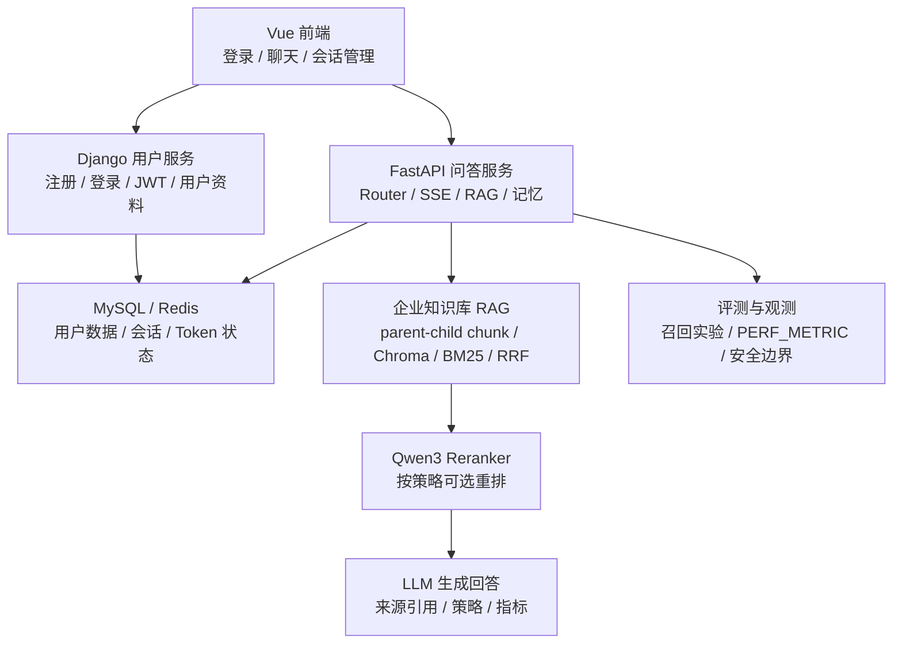

# NexusKB 工作记录

## 项目目前情况（首次记录：2026-06-12）

NexusKB 目前定位为面向企业员工的聊天式知识助手，主线是把基础聊天、企业 RAG、记忆、权限安全、工具调用和评测观测收敛成可调试、可评测、可展示的 Agentic RAG 工程闭环。

## 工作记录

| 时间 | 工作 |
| --- | --- |
| 2026-06-12 16:48 | 新建根目录工作记录文档，并在顶部补充项目当前状态图示。 |
| 2026-06-12 22:04 | 完成 Elasticsearch 企业检索后端开发，并合并回本地 main。 |
| 2026-06-13 17:03 | 完成 Elasticsearch smoke：启动容器、入库 100 条并跑通 ES 后端评测。 |
