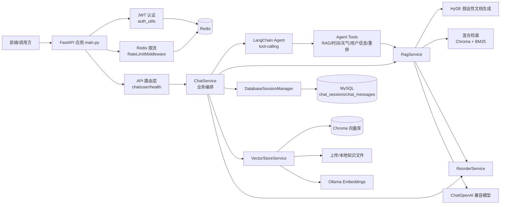
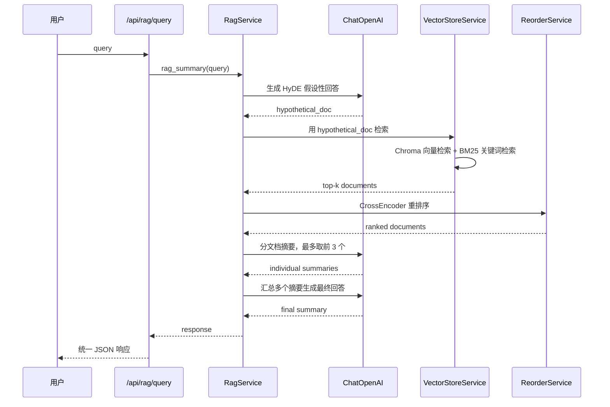
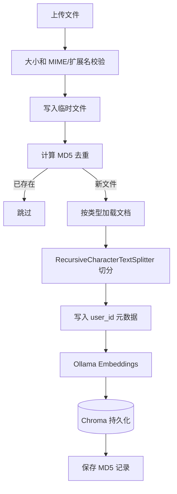
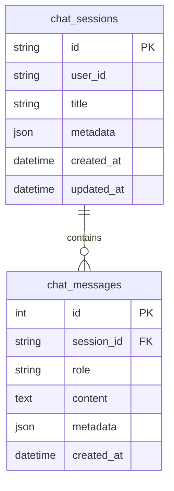

# 后端技术与架构总结

本文档基于 `backend` 目录当前源码整理，重点说明该后端使用的技术手段、实现功能、主要模块和运行数据流。

## 1. 项目定位

该后端是一个基于 FastAPI + LangChain 的 RAG/Agent 服务，面向“带会话记忆的智能问答”和“私有知识库检索增强生成”场景。它对外提供：

- Agent 流式问答接口，支持 SSE 推送、工具调用、会话历史写入。
- RAG 检索摘要接口，支持向量检索、BM25 关键词检索、HyDE 查询扩展、重排序和摘要生成。
- 文件上传入库接口，将 PDF、TXT、Markdown、PPTX、DOCX 等文档切分后写入 Chroma 向量库。
- 会话管理接口，基于 MySQL 持久化用户会话与消息。
- JWT 认证、Redis 限流、Redis 用户信息缓存、健康检查、统一响应与异常处理。

## 2. 技术栈

| 类型 | 技术/库 | 用途 |
| --- | --- | --- |
| Web 框架 | FastAPI, Starlette, Uvicorn | HTTP API、依赖注入、中间件、SSE 流式响应 |
| LLM 编排 | LangChain, LangChain Core, LangChain Community | Agent、Prompt、Chain、Retriever、Tool |
| Agent 模型 | `langchain_openai.ChatOpenAI` | 兼容 OpenAI 协议的 DeepSeek/本地兼容服务调用 |
| Embedding | `langchain_ollama.OllamaEmbeddings` | 通过 Ollama 本地服务生成文本向量 |
| 向量数据库 | Chroma / `langchain-chroma` | 文档向量持久化和相似度检索 |
| 关键词检索 | BM25Retriever | 和向量检索组合成混合检索 |
| 重排序 | `sentence-transformers.CrossEncoder` + PyTorch | 使用 Qwen3-Reranker-0.6B 对检索文档重新排序 |
| 数据库 | MySQL + SQLAlchemy Async + aiomysql | 会话与消息持久化 |
| 缓存/限流 | Redis asyncio | 用户信息缓存、JWT 黑名单检查、IP 限流 |
| 认证 | python-jose + HTTP Bearer | 解析 Django JWT，提取 `user_id` |
| 文件解析 | PyPDFLoader, TextLoader, Unstructured loaders | PDF/TXT/Markdown/PPTX/DOCX 文档读取 |
| 配置 | `.env` + YAML + python-dotenv | 模型、数据库、Prompt、Chroma 配置 |
| 日志 | Python logging | 控制台和 `logs/agent_YYYYMMDD.log` 文件日志 |

## 3. 目录结构

```text
backend/
├── main.py                         # FastAPI 应用入口，注册中间件、路由、启动/关闭事件
├── api.md                          # 现有接口文档
├── README_RERANKER.md              # Qwen3-Reranker 安装与使用说明
├── pyproject.toml                  # Python 依赖与 uv 配置
├── requirements.txt                # 旧版/基础依赖清单
├── app/
│   ├── router/                     # API 路由层
│   ├── agent/                      # LangChain Agent、工具、中间件
│   ├── rag/                        # RAG、向量库、文本切分、重排序
│   ├── services/                   # 会话管理服务
│   ├── models/                     # SQLAlchemy ORM 模型
│   ├── schemas/                    # Pydantic 请求/响应模型
│   ├── db/                         # MySQL 与 Redis 连接配置
│   ├── core/                       # 响应封装、异常处理、限流、日志
│   ├── utils/                      # 配置、路径、文件加载、认证、模型工厂
│   ├── config/                     # rag/chroma/prompt/agent YAML 配置
│   └── prompt/                     # Agent/RAG/报告/重排序 Prompt 模板
└── logs/                           # 运行日志
```

## 4. 总体架构



## 5. 主要功能模块

### 5.1 FastAPI 入口

入口文件是 `main.py`，核心职责：

- 创建 `FastAPI()` 应用实例。
- 注册全局 Redis 限流中间件，默认每 IP 每分钟 100 次请求。
- 为每个请求添加 `X-Process-Time` 响应头。
- 注册 `chat_router`、`health_router`、`user_router`。
- 开启 CORS，当前允许所有来源、方法和请求头。
- 注册统一异常处理器。
- 启动时初始化 MySQL 表结构、数据库会话管理器、Redis 连接。
- 关闭时释放 Redis 连接。

### 5.2 API 路由

| 路由 | 方法 | 功能 | 认证/限流 |
| --- | --- | --- | --- |
| `/api/agent/query/stream` | POST | Agent 流式问答，SSE 返回 | JWT，10/min |
| `/api/rag/query` | POST | RAG 检索摘要 | 15/min |
| `/api/session/{session_id}` | GET | 获取指定会话历史 | JWT |
| `/api/session/{session_id}` | DELETE | 删除指定会话 | JWT |
| `/api/sessions` | GET | 获取所有会话 ID | 当前代码未加 JWT |
| `/api/sessions/{user_id}` | GET | 获取某用户会话列表 | JWT，强制只能查自己 |
| `/api/vector/add/single` | POST | 单文件入向量库 | JWT，5/min |
| `/api/vector/add/multiple` | POST | 多文件入向量库 | JWT，3/min |
| `/api/vector/clean` | DELETE | 删除当前用户上传向量 | JWT |
| `/api/reorder` | POST | 对文档列表做重排序 | 20/min |
| `/user/detail/` | GET | 获取当前用户信息 | JWT |
| `/health/live` | GET | 存活检查 | 无 |
| `/health/ready` | GET | MySQL + Redis 就绪检查 | 无 |

### 5.3 Agent 问答

Agent 由 `app/agent/agent.py` 中的 `AgentFactory` 创建，使用 LangChain 的 `create_tool_calling_agent` 和 `AgentExecutor`。每次请求都会创建新的 AgentExecutor，避免复用全局运行状态。

默认工具：

- `rag_summary_tools`：从向量库检索文档并生成摘要。
- `reorder_documents_tools`：对文档列表做 CrossEncoder 重排序。
- `get_user_info_tools`：解析 JWT 中的用户 ID 和用户名。
- `get_weather_tools`：天气查询占位实现，目前返回固定晴朗文案。
- `what_time_is_now`：返回当前年月日时分。

流式接口使用 `StreamingResponse` 返回 `text/event-stream`，事件格式大致为：

```text
data: {"type": "response", "content": "...", "session_id": "..."}
data: {"type": "done", "session_id": "..."}
data: {"type": "error", "content": "...", "session_id": "..."}
```

### 5.4 RAG 检索增强生成

RAG 主流程位于 `app/rag/rag_service.py`，组合了 HyDE、混合检索、重排序和分批摘要。



关键技术点：

- HyDE：先让模型基于用户问题生成“假设性回答”，再用该文本检索，提高语义检索召回。
- 混合检索：Chroma 向量检索 + BM25 关键词检索，通过 `EnsembleRetriever` 合并。
- 动态权重：长查询偏向向量检索，短查询偏向 BM25，中等查询使用 0.5/0.5。
- 重排序：使用本地 `Qwen/Qwen3-Reranker-0.6B` CrossEncoder 给候选文档打分并降序排列。
- 分批摘要：默认最多取前 3 篇文档，先并发生成单文档摘要，再综合生成最终回答。

### 5.5 文件入库与向量存储

文件上传入口在 `ChatService.handle_add_vector_single/multiple`，实际入库由 `VectorStoreService.get_document` 完成。



支持格式：

- PDF：`PyPDFLoader`
- TXT：`TextLoader`，尝试 `utf-8` 和 `gbk`
- Markdown：`UnstructuredMarkdownLoader`
- PPT/PPTX：`UnstructuredPowerPointLoader`
- DOCX：当前实现使用 `TextLoader`，这对真实 docx 二进制格式可能不可靠

Chroma 配置位于 `app/config/chroma.yaml`：

- collection：`rag_collection`
- persist directory：`data/chromadb`
- top-k：`5`
- chunk size：`200`
- chunk overlap：`20`
- MD5 记录：`data/md5_hex_store/md5_hex_store.txt`

### 5.6 会话持久化

会话管理由 `DatabaseSessionManager` 负责，数据落在 MySQL。



设计特点：

- `chat_sessions.user_id` 关联外部 Django 用户服务，但不设置物理外键。
- 获取、写入、删除会话时校验 `session_id` 是否属于当前 `user_id`。
- 新会话默认标题为“新的对话”，首次写入时用用户问题前 30 个字符作为标题。
- 会话历史以 `(user_message, assistant_message)` 元组列表返回，便于构造 LangChain chat history。

### 5.7 认证与用户信息

认证逻辑位于 `app/utils/auth_utils.py`：

- 使用 HTTP Bearer 提取 JWT。
- 使用 `.env` 中的 `SECRET_KEY` 和 `ALGORITHM` 解码 Django JWT。
- 从 payload 中读取 `user_id`。
- 使用 Redis 通配符 `*blacklist:{jti}` 检查 token 是否被吊销。
- 用户信息优先读 Redis key `:1:user:{user_id}`，未命中时调用 Django API `/user/detail/`，成功后缓存 1 小时。

### 5.8 Redis 使用点

Redis 主要承担四类职责：

- 全局限流：`rate_limit:global:{client_ip}`
- 接口级限流：`rate_limit:aichat:{client_ip}`
- 用户信息缓存：`:1:user:{user_id}`
- JWT 黑名单检查：匹配 `*blacklist:{jti}`

注意：`.env.example` 暴露了 Redis 配置项，但 `app/db/redis_config.py` 当前写死为 `localhost:6379/db=3`，没有读取 `.env` 中的 `REDIS_HOST/REDIS_PORT/REDIS_DB`。

## 6. 配置与模型

### 6.1 LLM

聊天模型通过 `ChatOpenAI` 创建，实际服务由环境变量控制：

- `DEEPSEEK_MODEL`
- `DEEPSEEK_API_KEY`
- `DEEPSEEK_BASE_URL`

如果未配置模型名，会回退到 `app/config/rag.yaml` 中的 `chat_model_name`，当前为 `qwen3-max`。

### 6.2 Embedding

Embedding 使用 Ollama：

```yaml
text_embedding_model_name: qwen3-embedding:0.6b
```

代码中 Ollama base URL 固定为：

```text
http://localhost:11434
```

### 6.3 重排序模型

重排序使用 `sentence_transformers.CrossEncoder`：

- 默认本地路径：`D:\Hugging_Face\models\Qwen3-Reranker-0.6B`
- Hugging Face 模型名：`Qwen/Qwen3-Reranker-0.6B`
- 设备选择：优先 CUDA，否则 CPU
- 懒加载：第一次调用重排序时加载模型

## 7. 统一响应与异常处理

成功响应统一为：

```json
{
  "code": 200,
  "message": "success",
  "data": {}
}
```

异常处理覆盖：

- FastAPI `HTTPException`
- 请求参数校验错误
- SQLAlchemy 完整性错误
- SQLAlchemy 通用错误
- 自定义 `BusinessException`
- 未捕获异常兜底

开发模式下会在响应 `data` 中携带原始错误、路径和堆栈信息；生产环境通过 `ENV=prod` 强制关闭详细错误泄露。

## 8. 启动依赖

运行该后端前需要准备：

- Python 3.12 及依赖环境
- MySQL，默认数据库名 `chat_history`
- Redis，当前代码默认连接 `localhost:6379` 的 DB 3
- Ollama 本地服务，默认 `http://localhost:11434`
- 可用的 OpenAI-compatible Chat API，例如 DeepSeek 或本地兼容服务
- Qwen3-Reranker-0.6B 本地模型文件，或允许首次下载
- 若使用用户信息回源，需要 Django 用户服务和可用的 `DJANGO_API_URL`

## 9. 实现观察

- 当前架构是典型的三层拆分：路由层只做协议适配，`ChatService` 做业务编排，RAG/Agent/Session/VectorStore 分别承载领域逻辑。
- RAG 方案相对完整：HyDE 增强召回、向量 + BM25 混合检索、CrossEncoder 重排序、分批摘要都有实现。
- 会话数据已从内存迁移到 MySQL，适合多进程/重启后保留历史。
- Redis 配置、Ollama base URL、重排序默认路径等有部分硬编码，部署到其他环境时需要调整代码或补配置读取。
- `/api/sessions` 当前未校验用户身份，会返回所有会话 ID；如果是生产接口，建议改为只返回当前用户会话或增加管理员权限判断。
- `word_loader` 当前用 `TextLoader` 读取 `.docx`，对真实 Word 文件支持不足，建议改用 `UnstructuredWordDocumentLoader` 或专门的 docx loader。
- `main.py` 导入了 `check_and_download_reranker_model`，但启动事件中实际没有调用，只记录跳过检查；如果期望自动下载，需要恢复调用。
- `agent_middleware.py` 定义了 LangChain/LangGraph 中间件，但当前 `AgentExecutor` 创建时没有把 `default_middleware` 传入，因此这些钩子可能没有实际生效。

