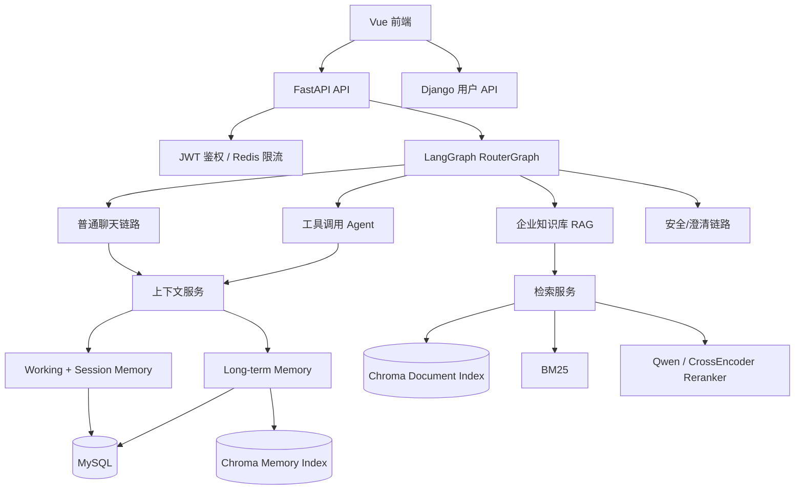

# NexusKB 项目大纲与系统框架

整理日期：2026-05-23

## 1. 项目定位

NexusKB 是一个面向企业知识库问答的多服务 AI 应用。它把企业文档检索、用户认证、会话管理、长期记忆、Agent 路由和前端交互组合成一套可运行、可扩展、可评测的知识助手系统。

项目主线不是“单轮聊天”，而是企业场景下的知识问答闭环：

```text
用户登录
  -> 提问或上传资料
  -> RouterGraph 判断请求类型
  -> 检索企业知识 / 普通聊天 / 工具调用 / 安全澄清
  -> 结合会话记忆和长期记忆生成回答
  -> 写入会话历史、更新摘要、抽取长期记忆
  -> 前端展示回答、会话和用户状态
```

## 2. 系统边界

| 子系统 | 目录 | 职责 |
| --- | --- | --- |
| FastAPI AI 后端 | `backend/` | RAG、LangGraph Router、Agent、会话记忆、长期记忆、文档入库、重排序、统一 API。 |
| Django 用户服务 | `DjangoUserService/` | 注册、登录、JWT、用户信息、文件服务、Token 黑名单和用户侧缓存。 |
| Vue 前端 | `front/` | 登录注册、聊天窗口、会话列表、个人中心、设置和多语言 UI。 |
| 文档与评测 | `docs/`、`backend/scripts/` | 架构说明、模块设计、部署排障、RAG 检索评测和实验记录。 |

## 3. 分层架构



## 4. 核心模块

### 4.1 RouterGraph

位置：`backend/app/agent/router_graph.py`

RouterGraph 使用 LangGraph `StateGraph` 把请求拆成可解释节点：

```text
START
  -> load_context
  -> llm_router
  -> validate_decision
  -> conditional route
       enterprise_knowledge -> enterprise_knowledge_node
       tool_action          -> tool_action_node
       chat                 -> chat_node
       unsafe_or_system     -> unsafe_or_system_node
       clarify              -> clarify_node
  -> persist_message
  -> format_response
END
```

`GraphState` 维护 query、user_id、session_id、历史、会话摘要、长期记忆、route、rag_intent、source_hints、answer、steps 和 error。

### 4.2 企业 RAG

位置：`backend/app/rag/`

RAG 链路负责把企业文档转换为可检索知识，并在问答时召回相关片段：

```text
文档上传
  -> 文件类型和大小校验
  -> 文本加载与切分
  -> embedding
  -> Chroma 入库

用户问题
  -> 向量检索 + BM25 关键词检索
  -> 融合与重排序
  -> 摘要 / grounded answer
```

### 4.3 记忆系统

位置：

- `backend/app/services/conversation_memory.py`
- `backend/app/services/long_term_memory.py`
- `backend/app/models/chat_history.py`

记忆分三层：

| 层级 | 生命周期 | 存储 | 用途 |
| --- | --- | --- | --- |
| Working Memory | 当前会话最近几轮 | MySQL chat messages | 保持当前对话连贯。 |
| Session Memory | 当前 session | MySQL summary | 压缩较早历史，减少上下文长度。 |
| Long-term Memory | 跨 session | MySQL + Chroma | 保存用户偏好、项目背景、长期约束并支持语义召回。 |

长期记忆设计要点：

- MySQL 是权威主库。
- Chroma 是语义检索索引。
- 所有检索和去重都使用 `user_id` + `status=active` 做隔离。
- 删除长期记忆时软删除 MySQL 记录，并尽力删除 Chroma 向量。
- 即使 Chroma 存在 stale document，语义去重也会回查 MySQL，避免已删除记忆继续生效。

### 4.4 用户服务

位置：`DjangoUserService/`

Django 用户服务负责身份体系：

- 用户注册、登录、登出。
- JWT 生成、刷新和校验基础。
- Redis Token 黑名单。
- 用户信息接口。
- 文件相关接口。

FastAPI 通过 `Authorization: Bearer <token>` 读取 Django JWT，并从 token 中提取 `user_id`。

### 4.5 前端

位置：`front/`

前端使用 Vue 3 + Vite，主要页面包括：

- 登录 / 注册。
- AI Chat。
- 会话列表。
- 个人中心。
- 设置页。
- 多语言与主题状态。

## 5. 数据存储

| 存储 | 用途 |
| --- | --- |
| MySQL | 用户数据、会话、消息、会话摘要、长期记忆权威数据。 |
| Redis | JWT 黑名单、用户信息缓存、接口限流。 |
| Chroma | 企业文档向量索引、长期记忆语义索引。 |
| 本地模型目录 | reranker、embedding 或其他本地模型权重。 |
| 本地数据目录 | 文档索引、评测数据、临时缓存，默认不提交。 |

## 6. 公开仓库内容边界

GitHub 仓库应只包含：

- 源码。
- 示例配置，例如 `.env.example`。
- 文档、架构说明和可复现实验脚本。
- 小型公开测试用例。

不要提交：

- 真实 `.env`、数据库密码、API Key、JWT 密钥。
- 简历、PDF 简历、面试材料、个人说明文档。
- 原始企业数据、私有评测集、本地向量库、模型权重。
- `node_modules`、虚拟环境、Conda 环境、日志和缓存。

## 7. 当前已具备能力

- FastAPI + Django + Vue 三端工程结构。
- JWT 鉴权、Redis 限流和统一响应。
- LangGraph RouterGraph 非流式与 SSE 路由链路。
- 普通聊天、企业知识库、工具调用、安全/澄清分支。
- MySQL 会话持久化和会话摘要压缩。
- MySQL + Chroma 双存储长期记忆。
- 当前用户长期记忆列表与删除接口。
- 文档上传、Chroma 入库、混合检索、reranker 评测脚本。

## 8. 后续演进方向

1. **部署与启动标准化**：补 Docker Compose，把 MySQL、Redis、FastAPI、Django、前端、Chroma/Ollama 运行方式固化。
2. **API 文档自动化**：从 OpenAPI 导出接口文档，减少手工维护漂移。
3. **长期记忆治理**：支持用户编辑、冲突检测、审计记录和记忆来源追踪。
4. **RAG 质量提升**：继续优化 chunk、召回融合、reranker 策略和引用展示。
5. **安全与权限**：完善系统操作确认、文件权限、向量数据隔离和敏感信息过滤。
6. **前端体验**：增加记忆管理页、引用来源展示、知识库上传进度和错误提示。
