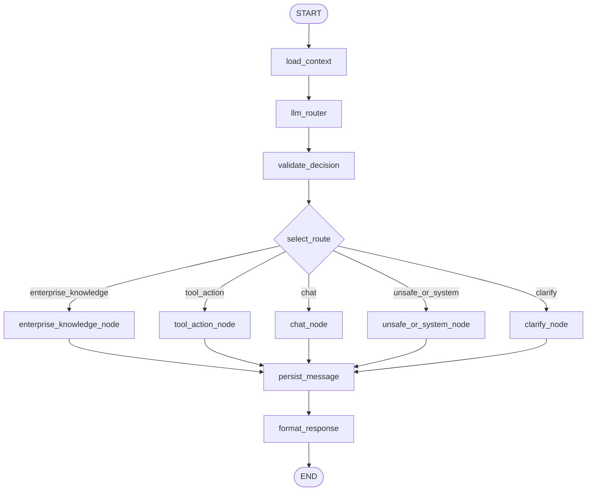

# LangGraph RouterGraph 设计

## 职责

RouterGraph 是 FastAPI AI 后端的请求调度层。它不直接把所有请求都交给一个 Agent，而是先读取上下文，再判断用户请求应该进入哪条链路：普通聊天、企业知识库、工具调用、安全保护或澄清。

核心实现位于：

```text
backend/app/agent/router_graph.py
```

`GraphState` 定义在同一文件中，用于在节点之间传递 query、user_id、session_id、历史、记忆、路由决策、回答和错误状态。

## 当前图结构



## GraphState

当前 State 主要字段：

```python
class GraphState(TypedDict):
    query: str
    user_id: str
    session_id: str
    history: NotRequired[list[tuple[str, str]]]
    memory_summary: NotRequired[str]
    memory_compressed_turns: NotRequired[int]
    memory_total_turns: NotRequired[int]
    long_term_memories: NotRequired[list[dict[str, Any]]]
    route: NotRequired[str]
    rag_intent: NotRequired[str]
    source_hints: NotRequired[list[str]]
    confidence: NotRequired[float]
    reason: NotRequired[str]
    answer: NotRequired[str]
    documents: NotRequired[list[Any]]
    steps: NotRequired[list[dict[str, Any]]]
    error: NotRequired[str | None]
```

## 路由枚举

顶层 `route` 只表示系统能力模块，不做过细业务分类。

| route | 说明 |
| --- | --- |
| `enterprise_knowledge` | 需要企业知识库、上传文档、内部资料、制度、项目细节回答。 |
| `tool_action` | 需要调用工具或受控 API，例如用户信息、时间、天气、重排序等。 |
| `chat` | 普通对话、开放问答、解释概念、写作、总结、翻译。 |
| `unsafe_or_system` | 删除、清空、重置、越权、危险系统操作或需要保守确认的系统请求。 |
| `clarify` | 用户意图不明确或缺少必要条件，需要反问。 |

历史别名会被规范化：

```text
rag_query       -> enterprise_knowledge
agent_tool_call -> tool_action
system          -> unsafe_or_system
```

## RAG 子意图

当 `route=enterprise_knowledge` 时，Router 还会输出 `rag_intent`：

```text
basic
semantic
intra_document_reasoning
project_related
constrained
conflicting_info
completeness
high_level
info_not_found
unknown
```

当 route 不是 `enterprise_knowledge` 时，`rag_intent` 固定为 `unknown`。

## 数据源提示

`source_hints` 表示 Router 认为更可能相关的数据来源，当前允许：

```text
confluence, jira, slack, github, google_drive, linear, gmail, hubspot, fireflies
```

当前阶段主要用于响应、日志和后续策略扩展，不等同于强制过滤。

## 节点职责

### load_context

- 读取或生成 `session_id`。
- 从 `conversation_memory_service` 读取会话摘要和最近历史。
- 从 `long_term_memory_service` 按当前 query 和 user_id 检索长期记忆。
- 如果记忆服务失败，记录 warning 并继续用空列表。

### llm_router

调用 LLM 输出结构化 JSON 路由决策。Router LLM 只分类，不回答问题。

### validate_decision

二次校验 LLM 输出：

- route 不在白名单时兜底到 `chat`。
- rag_intent 不在白名单时设为 `unknown`。
- source_hints 不在白名单时过滤。
- 非企业知识库 route 的 rag_intent 强制为 `unknown`。
- 低置信度非 chat/clarify route 会转为 `clarify`。

### enterprise_knowledge_node

调用 `enterprise_rag_service.get_documents_and_summary(...)`，返回企业知识库答案、检索文档和策略步骤。

### tool_action_node

调用 `_run_agent_node(..., tool_profile="full")`，进入完整工具调用 Agent。

### chat_node

调用 `get_chat_response(...)`，进入普通聊天链路。该链路会接收会话历史和长期记忆，但不直接走完整工具池。

### unsafe_or_system_node

对删除、清空、重置、越权等系统类请求保持保守，不直接执行危险操作，而是返回确认/保护提示。

### clarify_node

返回简短追问，引导用户补充请求目标、数据范围或上下文。

### persist_message

- 将用户问题和最终回答写入会话历史。
- 更新 session memory 摘要。
- 抽取并保存 long-term memory。
- 长期记忆抽取失败只记录 warning，不影响用户响应。

### format_response

保持最终 state，供 `invoke()` 整理成统一响应结构。

## 非流式接口

```text
POST /api/agent/router/query
```

响应结构包含：

```json
{
  "session_id": "...",
  "route": "chat",
  "rag_intent": "unknown",
  "source_hints": [],
  "confidence": 0.9,
  "reason": "...",
  "response": "...",
  "steps": [],
  "error": null
}
```

## SSE 流式接口

```text
POST /api/agent/query/stream
```

流式接口同样先经过 RouterGraph：

```text
load_context -> llm_router -> validate_decision -> route event
```

- `chat` route：委托 `get_chat_stream_response(...)`。
- `tool_action` route：委托 `get_agent_stream_response(...)`。
- `enterprise_knowledge`、`unsafe_or_system`、`clarify`：执行对应节点后返回 response/done 事件。

## 与长期记忆的关系

RouterGraph 在 `load_context` 中加载长期记忆，并把 `long_term_memories` 传入 Chat/Agent prompt。非流式路径在 `persist_message` 后抽取长期记忆；流式 chat/tool 路径在各自流式函数中完成会话持久化和长期记忆抽取，避免重复写入。

## 当前限制

- Router LLM 的输出质量仍影响初始分流，必须依赖 `validate_decision` 做防御性校验。
- 企业 RAG 和普通 RAG 仍有并存历史，后续需要进一步统一策略层。
- 完整 live 验证依赖 MySQL、Redis、JWT、LLM 和 Chroma/Ollama 等外部服务。

## 下一步

- 增加 RouterGraph 节点级集成测试。
- 将 route/rag_intent/source_hints 与检索策略更紧密地联动。
- 增加前端对 route、引用来源和长期记忆命中的可视化展示。
