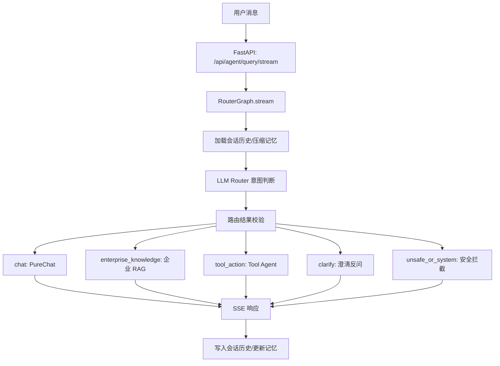

# 当前框架、技术与模块回顾

本文档用于回顾当前项目已经形成的整体框架、核心技术栈、主要模块分工，以及最近完成的主链路改造。结构按“总体 -> 模块 -> 详细”展开，方便后续继续做高并发、低延迟和可观测优化。

## 一、总体

### 1. 项目定位

当前项目是一个面向企业知识问答和智能对话的后端服务，核心形态是：

- FastAPI 提供 HTTP API 和 SSE 流式接口。
- LangChain 负责 LLM Chain、Tool Agent、Prompt 和工具编排。
- RouterGraph 作为聊天主入口，先判断用户意图，再进入对应链路。
- 企业知识库使用 RAG 检索增强生成。
- 普通聊天使用轻量 PureChat 链，不默认进入完整 Tool Agent。
- 会话历史和压缩记忆由 MySQL 持久化。
- Redis 用于限流、缓存和 JWT 黑名单检查。

当前主目标不是单纯做一个“能回答问题”的聊天接口，而是把系统拆成清晰的多链路智能服务：

- 普通聊天
- 企业知识库问答
- 工具调用
- 澄清反问
- 危险/系统类请求拦截

### 2. 当前主链路

现在的聊天主入口已经统一为：

```text
用户消息
  -> FastAPI /api/agent/query/stream
  -> RouterGraph
  -> load_context 加载会话记忆
  -> LLM Router 判断意图
  -> validate_decision 校验路由结果
  -> 按 route 分支执行
      -> chat: PureChat 轻链路
      -> enterprise_knowledge: 企业 RAG 链路
      -> tool_action: 完整 Tool Agent
      -> clarify: 澄清反问
      -> unsafe_or_system: 危险/系统请求拦截
  -> SSE 返回
  -> 写入会话历史并更新压缩记忆
```

用图表示：



### 3. 当前已完成的关键演进

最近已经完成三件核心事情：

1. 统一聊天主入口

   流式聊天不再直接进入 Agent，而是先经过 RouterGraph。系统会先判断用户消息属于普通聊天、企业知识库、工具调用、澄清还是危险请求。

2. 拆出纯聊天链

   普通聊天走 PureChat，只使用会话记忆和基础 LLM，不再默认进入完整 Tool Agent。只有明确需要工具时才进入 Tool Agent。

3. 落地 RAG 策略矩阵

   企业知识库默认使用 Chroma + BM25 + RRF；复杂、精确、低置信度问题启用 reranker；来源提示做软加权，不做硬过滤；简单闲聊和通用写作改写不查企业知识库。

### 4. 技术栈总览

| 层级 | 技术/组件 | 当前用途 |
| --- | --- | --- |
| Web 框架 | FastAPI, Starlette, Uvicorn | API、依赖注入、SSE 流式响应 |
| LLM 编排 | LangChain, LangChain Core | Chain、Prompt、Tool、Agent |
| 路由编排 | LangGraph StateGraph | RouterGraph 多分支主链路 |
| LLM 调用 | ChatOpenAI 兼容接口 | DeepSeek 或 OpenAI-compatible 服务 |
| 向量库 | Chroma / langchain-chroma | 企业知识库和上传知识库向量检索 |
| Embedding | OllamaEmbeddings | 本地 embedding 服务 |
| 关键词检索 | 自实现 BM25 / LangChain BM25 | 企业 RAG 和普通上传知识库混合检索 |
| 排名融合 | RRF | 融合 Chroma 与 BM25 候选 |
| 重排序 | sentence-transformers CrossEncoder | Qwen3-Reranker-0.6B reranker |
| 会话存储 | MySQL + SQLAlchemy Async | 会话、消息、压缩记忆持久化 |
| 缓存/限流 | Redis asyncio | 用户缓存、限流、JWT 黑名单 |
| 认证 | HTTP Bearer + python-jose | 解析 Django JWT |
| 文件处理 | LangChain loaders / Unstructured | PDF/TXT/Markdown/PPTX/DOCX 等入库 |
| 配置 | .env + YAML | 模型、数据库、Chroma、Prompt 配置 |
| 日志 | Python logging | 运行日志和链路调试 |

## 二、模块

### 1. API 路由模块

位置：

- `backend/app/router/chat.py`
- `backend/app/router/chat_service.py`
- `backend/app/router/user.py`
- `backend/app/router/health.py`

职责：

- 对外暴露 HTTP API。
- 做参数接收、认证依赖、限流依赖和响应封装。
- 将业务处理交给 ChatService 或 RouterGraph。

当前最重要的入口：

```text
POST /api/agent/query/stream
```

这个接口当前已经直接调用：

```python
router_graph.stream(request.query, user_id, session_id)
```

也就是说，流式聊天统一先经过 Router。

主要接口：

| 接口 | 作用 |
| --- | --- |
| `/api/agent/query/stream` | 聊天主入口，SSE 流式返回 |
| `/api/agent/router/query` | RouterGraph 非流式查询 |
| `/api/rag/query` | 传统 RAG 摘要查询 |
| `/api/session/{session_id}` | 获取或删除会话 |
| `/api/sessions` | 获取会话列表 |
| `/api/vector/add/single` | 单文件入库 |
| `/api/vector/add/multiple` | 多文件入库 |
| `/api/vector/clean` | 清理用户上传向量 |
| `/api/reorder` | 文档重排序接口 |

### 2. RouterGraph 模块

位置：

- `backend/app/agent/router_graph.py`

职责：

- 作为聊天系统的主调度器。
- 先加载会话上下文。
- 调用 LLM Router 判断 route。
- 校验 route、rag_intent、source_hints、confidence。
- 分派到对应链路。
- 非流式场景负责统一写入历史。
- 流式场景把流交给下游链路。

当前支持的 route：

| route | 含义 | 下游链路 |
| --- | --- | --- |
| `chat` | 普通聊天、通用解释、写作改写、安全小工具 | PureChat |
| `enterprise_knowledge` | 需要企业知识库、内部资料、制度、项目细节 | EnterpriseRagService |
| `tool_action` | 需要受控工具、内部/外部 API、用户信息、系统状态 | Full Tool Agent |
| `clarify` | 意图不明确或缺少必要条件 | 澄清反问 |
| `unsafe_or_system` | 删除、清空、重置、越权等危险请求 | 安全拦截 |

Router 输出结构：

```json
{
  "route": "enterprise_knowledge",
  "rag_intent": "constrained",
  "source_hints": ["confluence"],
  "confidence": 0.82,
  "reason": "用户询问企业内部制度"
}
```

### 3. PureChat 普通聊天模块

位置：

- `backend/app/agent/agent.py`

核心函数：

- `get_chat_response`
- `get_chat_stream_response`
- `AgentFactory.create_chat_chain`

职责：

- 处理普通聊天。
- 使用基础 LLM 和会话记忆。
- 不创建 Tool Agent。
- 不使用 `agent_scratchpad`。
- 不访问企业知识库。
- 不默认调用完整工具池。

PureChat 当前只允许显式安全小工具结果注入，例如：

- 当前时间
- 天气占位工具

PureChat 的意义：

- 降低普通聊天延迟。
- 避免工具误调用。
- 避免简单问题误查企业知识库。
- 让主链路更容易理解和调优。

### 4. Tool Agent 工具调用模块

位置：

- `backend/app/agent/agent.py`
- `backend/app/agent/agent_tools.py`
- `backend/app/agent/agent_middleware.py`

核心函数：

- `get_agent_response`
- `get_agent_stream_response`
- `AgentFactory.create_agent_executor`

职责：

- 只有 Router 判断为 `tool_action` 时进入。
- 使用 LangChain `create_tool_calling_agent`。
- 每次请求创建新的 `AgentExecutor`，避免全局运行状态污染。
- 可以调用完整工具池。

当前工具池：

| 工具 | 作用 |
| --- | --- |
| `rag_summary_tools` | 从普通上传知识库检索并生成摘要 |
| `get_weather_tools` | 天气占位工具 |
| `what_time_is_now` | 当前时间工具 |
| `get_user_info_tools` | 从 JWT 解析用户信息 |
| `reorder_documents_tools` | 调用 reranker 重排序 |

当前有两个工具 profile：

| profile | 用途 |
| --- | --- |
| `chat_safe` | 只包含天气、时间等低风险工具 |
| `full` | 包含 RAG、用户信息、重排序等完整工具 |

### 5. 企业 RAG 模块

位置：

- `backend/app/rag/enterprise_rag_service.py`

职责：

- 处理 Router 分到 `enterprise_knowledge` 的请求。
- 面向 EnterpriseRAG-Bench parent-child 数据集。
- 使用 Chroma + BM25 + RRF 做默认混合检索。
- 根据问题复杂度和 Router 置信度决定是否启用 reranker。
- 根据 source_hints 做软加权。
- 基于检索结果生成回答。

当前 RAG 策略矩阵：

| 场景 | 策略 |
| --- | --- |
| 默认企业知识库问题 | Chroma + BM25 + RRF |
| 复杂问题 | 启用 reranker |
| 精确/约束问题 | 启用 reranker |
| Router 低置信度 | 启用 reranker |
| 有来源提示 | source hint soft boost |
| 简单闲聊/通用解释/写作改写 | Router 分到 chat，不查企业知识库 |

当前复杂 intent 包括：

- `semantic`
- `intra_document_reasoning`
- `project_related`
- `constrained`
- `conflicting_info`
- `completeness`
- `high_level`

低置信度阈值：

```text
confidence < 0.65
```

来源提示策略：

```text
source_hints 不做硬过滤，只给匹配来源的文档加权。
```

### 6. 普通上传知识库 RAG 模块

位置：

- `backend/app/rag/rag_service.py`
- `backend/app/rag/vector_store.py`

职责：

- 处理用户上传文档的传统 RAG。
- 使用 Chroma 向量库。
- 支持 BM25 + 向量检索组合。
- 支持 HyDE 查询增强。
- 支持 reranker 重排序。
- 支持文档摘要生成。

该模块当前主要服务：

- `/api/rag/query`
- Agent 工具 `rag_summary_tools`
- 用户上传文件后的普通知识库检索

它和企业 RAG 的区别：

| 模块 | 数据来源 | 当前用途 |
| --- | --- | --- |
| `RagService` | 用户上传文档 Chroma collection | 普通知识库 RAG |
| `EnterpriseRagService` | EnterpriseRAG-Bench parent-child collection | 企业知识库主链路 |

### 7. Reranker 重排序模块

位置：

- `backend/app/rag/reorder_service.py`

职责：

- 懒加载 Qwen3-Reranker-0.6B。
- 使用 `sentence_transformers.CrossEncoder`。
- 对 query-document pair 进行相关性打分。
- 返回按 similarity 降序排列的文档。

特点：

- 默认本地路径：`D:\Hugging_Face\models\Qwen3-Reranker-0.6B`
- 优先使用 CUDA，否则 CPU。
- 模型懒加载，第一次调用时加载。
- 现在在企业 RAG 中只对复杂/低置信度请求启用，避免所有请求都承受 reranker 延迟。

### 8. 会话和记忆模块

位置：

- `backend/app/services/database_session_manager.py`
- `backend/app/services/conversation_memory.py`
- `backend/app/models/chat_history.py`

职责：

- MySQL 持久化会话和消息。
- 根据 `session_id + user_id` 校验会话归属。
- 为 LangChain 构造 `(user_message, assistant_message)` 历史。
- 对长会话做两层记忆压缩。

两层记忆结构：

```text
长期摘要 summary
  + 最近 N 轮原文 recent_history
  -> to_agent_history()
```

默认参数：

| 参数 | 值 |
| --- | --- |
| 最近窗口 | 6 轮 |
| 摘要触发 | 超过 10 轮 |

### 9. 文件入库和向量存储模块

位置：

- `backend/app/rag/vector_store.py`
- `backend/app/rag/text_spliter.py`
- `backend/app/utils/file_handler.py`

职责：

- 接收上传文件。
- 校验文件大小和类型。
- 解析文件内容。
- 文本切分。
- 生成 embedding。
- 写入 Chroma。
- 记录 MD5，避免重复入库。

支持格式：

- PDF
- TXT
- Markdown
- PPTX
- DOCX

注意：

DOCX 当前需要重点复核 loader 是否真正适配 Word 二进制格式，后续可以替换为更可靠的 Word loader。

### 10. 认证、限流和基础设施模块

位置：

- `backend/app/utils/auth_utils.py`
- `backend/app/core/rate_limit.py`
- `backend/app/db/redis_config.py`
- `backend/app/db/db_config.py`
- `backend/app/core/success_response.py`
- `backend/app/core/failed_response.py`

职责：

- JWT Bearer 认证。
- 从 Django JWT 中提取 `user_id`。
- Redis 检查 JWT 黑名单。
- Redis 缓存用户信息。
- Redis 做全局和接口级限流。
- MySQL 异步连接。
- 统一成功/失败响应。

## 三、详细

### 1. RouterGraph 的详细执行逻辑

RouterGraph 的状态结构包含：

```python
query: str
user_id: str
session_id: str
history: list[tuple[str, str]]
memory_summary: str
route: str
rag_intent: str
source_hints: list[str]
confidence: float
reason: str
answer: str
documents: list
steps: list
error: str | None
```

关键节点：

| 节点 | 作用 |
| --- | --- |
| `load_context` | 加载压缩记忆和最近历史 |
| `llm_router` | 调用 LLM 判断 route |
| `validate_decision` | 规范化 route、rag_intent、source_hints、confidence |
| `enterprise_knowledge_node` | 企业 RAG |
| `tool_action_node` | 完整 Tool Agent |
| `chat_node` | PureChat |
| `unsafe_or_system_node` | 危险请求拦截 |
| `clarify_node` | 澄清反问 |
| `persist_message` | 写入消息并更新记忆 |
| `format_response` | 格式化最终结果 |

流式场景下，RouterGraph 会先返回 route 事件：

```json
{
  "type": "route",
  "session_id": "...",
  "route": "chat",
  "rag_intent": "unknown",
  "source_hints": [],
  "confidence": 0.91,
  "reason": "普通对话"
}
```

然后再交给对应分支继续流式输出。

### 2. PureChat 和 Tool Agent 的边界

当前设计原则：

```text
普通聊天不进完整 Agent。
只有明确工具需求才进 Tool Agent。
```

PureChat 输入：

- 用户问题
- 会话历史
- 系统提示词
- 可选安全工具结果

PureChat 不包含：

- Agent scratchpad
- 完整工具池
- 企业知识库检索
- 用户信息工具
- 重排序工具

Tool Agent 输入：

- 用户问题
- 会话历史
- 系统提示词
- 完整工具池

Tool Agent 适合：

- 用户明确要求调用系统能力。
- 查询用户信息。
- 查询内部或外部 API。
- 需要工具执行结果才能回答。

### 3. 企业 RAG 的详细策略

企业 RAG 当前默认检索流程：

```text
query
  -> Chroma similarity_search_with_score
  -> BM25 search
  -> RRF 融合排名
  -> source_hints 软加权
  -> 条件性 reranker
  -> top-k 文档
  -> summary_chain 生成回答
```

#### 3.1 Chroma 检索

Chroma 用于语义召回，适合：

- 同义表达
- 问题语义和原文措辞不完全一致
- 长文本上下文相关问题

#### 3.2 BM25 检索

BM25 用于关键词召回，适合：

- 专有名词
- 文档标题
- ID
- 精确字段
- 用户问题中有明确关键词的场景

企业 RAG 里目前实现了轻量 BM25 索引，不额外引入依赖。索引来源为 parent chunks，索引字段包括：

- title
- section_heading
- source_type
- text

#### 3.3 RRF 排名融合

RRF 用于融合多个排名列表：

```text
score += 1 / (RRF_K + rank)
```

当前：

```text
RRF_K = 60
```

这样可以避免强行比较 Chroma 分数和 BM25 分数，因为两者分数尺度不同。

#### 3.4 来源提示软加权

当 Router 输出 `source_hints` 时，例如：

```json
["confluence", "jira"]
```

企业 RAG 不会硬过滤其他来源，而是对匹配来源的文档做 boost：

```text
score = score * (1 + SOURCE_HINT_SOFT_BOOST)
```

当前：

```text
SOURCE_HINT_SOFT_BOOST = 0.15
```

这样可以保留召回弹性，避免 Router 来源判断不准时错杀正确文档。

#### 3.5 reranker 启用条件

reranker 不是默认全量启用，而是条件启用：

```text
rag_intent 属于复杂 intent
或 router_confidence < 0.65
```

复杂 intent：

```text
semantic
intra_document_reasoning
project_related
constrained
conflicting_info
completeness
high_level
```

这样能在准确率和延迟之间做折中：

- 简单问题：Chroma + BM25 + RRF 足够快。
- 复杂问题：reranker 提升精度。
- 低置信度：reranker 兜底提升排序质量。

### 4. 会话记忆的详细机制

会话历史原始数据存在 MySQL：

```text
chat_sessions
chat_messages
chat_session_memory
```

当会话轮次较少时，直接使用完整历史。

当会话超过阈值时：

```text
较早历史 -> LLM 总结 -> summary
最近几轮 -> 保留原文
summary + recent_history -> 传给 Router/PureChat/Agent
```

这样做的目的：

- 控制上下文长度。
- 保留近期精确信息。
- 保留长期目标、偏好和项目背景。
- 降低每次请求 token 消耗。

### 5. SSE 流式输出格式

当前流式事件主要包括：

```json
{"type": "route", "route": "chat", "...": "..."}
{"type": "response", "content": "..."}
{"type": "done", "session_id": "..."}
{"type": "error", "content": "..."}
```

当前分支特点：

- chat 分支可以逐 chunk 输出 LLM 内容。
- tool_action 分支可以输出 Agent 最终内容，也可保留工具 step。
- enterprise_knowledge 当前主要是先检索和生成摘要，再输出最终 response。

后续如果做低延迟体验优化，可以给企业 RAG 增加阶段事件：

```text
retrieving
reranking
summarizing
```

这样用户能感知系统正在工作，而不是等待空白。

### 6. 当前代码分层

当前后端主要目录：

```text
backend/app/
  agent/
    agent.py
    agent_tools.py
    router_graph.py
    agent_middleware.py

  rag/
    enterprise_rag_service.py
    rag_service.py
    vector_store.py
    reorder_service.py
    text_spliter.py

  router/
    chat.py
    chat_service.py
    user.py
    health.py

  services/
    database_session_manager.py
    conversation_memory.py

  models/
    chat_history.py

  schemas/
    models.py

  db/
    db_config.py
    redis_config.py

  core/
    rate_limit.py
    success_response.py
    failed_response.py
    logger_handler.py

  utils/
    auth_utils.py
    factory.py
    config.py
    config_handler.py
    prompt_loader.py
    file_handler.py
    path_tool.py
```

### 7. 当前架构的优点

现在的结构相比最初更清楚：

1. 主入口清楚

   用户聊天请求先到 RouterGraph，再进入分支。

2. 普通聊天轻量化

   PureChat 不再背负 Tool Agent 成本。

3. RAG 策略工程化

   默认混合检索，复杂场景再启用 reranker。

4. 来源提示更稳健

   软加权避免硬过滤造成误伤。

5. 会话记忆可持续

   MySQL 持久化 + 压缩摘要支持长会话。

6. 后续优化方向明确

   可以围绕 Router、PureChat、RAG、reranker、LLM summary 分别做耗时观测和并发治理。

### 8. 当前主要风险和后续重点

#### 8.1 性能观测还不够细

现在日志能看到部分链路，但还缺少统一耗时指标：

- Router 耗时
- PureChat LLM 首 token 延迟
- Chroma 检索耗时
- BM25 检索耗时
- RRF 融合耗时
- reranker 耗时
- summary_chain 耗时
- MySQL 读写耗时

下一步建议先做这部分。

#### 8.2 reranker 是重资源节点

reranker 使用 CrossEncoder，准确但延迟和显存/CPU 消耗较高。当前已经改为条件启用，但后续还应增加：

- 并发限制
- 候选数量上限
- 超时降级
- 模型预热

#### 8.3 企业 RAG 的 BM25 当前是内存索引

当前 BM25 索引基于 parent chunks 构建在内存里。优点是简单直接，缺点是：

- 首次构建有成本。
- 多进程部署会重复构建。
- 数据变更后需要刷新索引。

后续可以考虑启动预热、索引持久化或独立检索服务。

#### 8.4 enterprise_knowledge 分支还不是完整流式

目前企业 RAG 分支会先完成检索、重排、摘要，再返回最终 response。用户等待期间没有细粒度阶段事件。

后续可以补：

```text
route -> retrieving -> reranking -> summarizing -> response -> done
```

#### 8.5 配置还有硬编码

一些路径或服务地址还需要进一步配置化：

- Ollama base URL
- reranker 默认本地路径
- Redis 配置
- 企业 Chroma collection 和 parent chunks 路径

## 四、下一步建议

如果继续按“高并发、低延迟”方向推进，建议顺序是：

1. 增加链路耗时埋点。
2. 给重资源节点加并发控制和超时降级。
3. 给企业 RAG 增加阶段性 SSE 事件。
4. 做 BM25 索引预热和缓存策略。
5. 梳理配置项，减少硬编码。
6. 根据真实耗时数据决定是否引入新技术。

我目前的判断是：现阶段先把现有链路跑稳、测清楚、压低延迟，比继续叠加新技术更划算。
