# NexusKB / RAGFlow 项目结构图

> 这份文档用 Mermaid 图从“大纲 → 服务 → 在线链路 → FastAPI 内部 → RouterGraph → Agentic RAG → 记忆 → 数据层 → 前端/Django → 评测与安全”逐层展开，方便快速理解项目每个部分。
>
> 在支持 Mermaid 的 Markdown 工具中可以直接渲染图，例如 VS Code Mermaid 插件、Typora、Obsidian、GitHub/GitLab 等。
>
> 状态说明：图中未特别标注的模块按当前代码理解；标注“规划/实验”的能力来自 agentic RAG 与长期记忆设计文档，表示已经纳入项目流程但可能尚未完全接线。

---

## 1. 项目一句话总览

NexusKB / RAGFlow 是一个面向企业知识库问答的多策略 Agentic RAG 系统：

```text
Vue 前端 → Django 用户服务签发 JWT → FastAPI 校验 JWT → RouterGraph 兼容入口 → AgenticRagGraph 主状态机 → direct_answer / retrieve / tool_call / clarify / refuse → RagEvidenceWorkflow → Dense+BM25+RRF+Reranker → SSE 流式返回 → MySQL/Redis/Chroma/评测闭环支撑
```

当前 Agentic RAG 核心变化是：`RouterGraph` 已收敛为旧 API 兼容入口；`AgenticRagGraph` 统一拥有 LangGraph 状态机；`RagEvidenceWorkflow` 统一拥有 planner、strategy、retrieval、evaluation、retry、web fallback、generation 和 trace finalization。

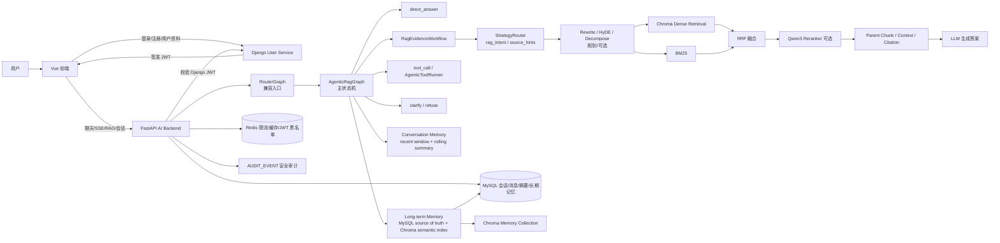

---

## 2. 顶层目录结构

```text
NexusKB-
├── backend/                        # FastAPI AI/RAG 后端：AgenticRagGraph、RagEvidenceWorkflow、检索、会话/长期记忆、评测脚本
├── DjangoUserService/              # Django 用户服务：注册、登录、JWT、头像、用户资料
├── front/                          # Vue 3 前端：登录、聊天、会话、个人中心、设置
├── docs/                           # 项目指南、Agentic RAG 专题、实验、运维、面试和归档文档
├── backend_learning_modules/       # 后端模块化学习样例
├── dataset/                        # 本地数据集，EnterpriseRAG-Bench、RAGCare-QA 等
├── models/                         # 本地模型权重，例如 Qwen3-Reranker
├── images/                         # 项目图片素材
├── docker-compose.elasticsearch.yml # Elasticsearch 检索评测环境
└── start-dev.ps1                   # 本地开发环境启动脚本
```

```mermaid
flowchart TD
    A[NexusKB / RAGFlow 项目] --> B[backend AI/RAG 后端]
    A --> D[DjangoUserService 用户服务]
    A --> F[front 前端]
    A --> DOC[docs 文档体系]
    A --> LEARN[backend_learning_modules 学习样例]
    A --> DATA[dataset / backend/data 数据集、索引与评测输出]
    A --> MODEL[models / Qwen3-Reranker 本地模型]
    A --> ES[docker-compose.elasticsearch.yml Elasticsearch 评测环境]

    F --> F1[登录 / 注册 UI]
    F --> F2[聊天页面 AIChat]
    F --> F3[会话列表 Sessions]
    F --> F4[个人中心 / 头像上传]
    F --> F5[Profile / Settings]

    D --> D1[JWT 鉴权]
    D --> D2[用户资料]
    D --> D3[头像文件上传]
    D --> D4[Token 黑名单]

    B --> B1[FastAPI 路由]
    B --> B2[RouterGraph 兼容入口]
    B --> B3[AgenticRagGraph 主状态机]
    B --> B4[RagEvidenceWorkflow 证据工作流]
    B --> B5[Hybrid Retrieval / RRF / Rerank / Graph Index]
    B --> B6[Conversation Memory / Long-term Memory]
    B --> B7[Audit / Perf / RateLimit / Debug Trace]
    B --> B8[离线评测与索引脚本]
```

---

## 3. 三个主服务关系

```mermaid
flowchart LR
    subgraph Client[浏览器]
        Vue[Vue 前端<br/>front/]
    end

    subgraph UserService[Django 用户服务<br/>DjangoUserService/]
        Auth[登录 / 注册]
        Profile[用户资料]
        UploadAvatar[头像上传]
        JWT[JWT 签发 / 刷新 / 黑名单]
    end

    subgraph AIBackend[FastAPI AI 后端<br/>backend/]
        ChatAPI[/api/agent/query/stream]
        Router[RouterGraph 兼容入口]
        Agentic[AgenticRagGraph]
        RAG[RagEvidenceWorkflow]
        Session[Session / Message / Conversation Memory]
        LTM[Long-term Memory<br/>实验/待完整接线]
        Vector[Vector / BM25 / RRF / Rerank / Classic RAG]
        Audit[Audit / Perf / RateLimit]
    end

    subgraph Storage[存储与基础设施]
        MySQL[(MySQL)]
        Redis[(Redis)]
        Chroma[(ChromaDB)]
        Files[(上传文件 / 本地数据)]
    end

    Vue -->|/user/login / register| Auth
    Auth -->|JWT| Vue
    Vue -->|Authorization: Bearer JWT| ChatAPI

    ChatAPI -->|校验 JWT| JWT
    ChatAPI --> Router
    ChatAPI --> Audit
    Router --> Agentic
    Agentic --> RAG
    Agentic --> Session
    Agentic --> LTM

    Auth --> MySQL
    Profile --> MySQL
    JWT --> Redis
    Session --> MySQL
    LTM --> MySQL
    LTM --> Chroma
    RAG --> Chroma
    RAG --> Files
```

| 服务 | 主要职责 |
| --- | --- |
| `front/` | 用户交互、登录注册页面、聊天流式展示、会话列表、个人中心 |
| `DjangoUserService/` | 用户注册登录、JWT 签发/刷新/黑名单、用户资料、头像上传 |
| `backend/` | AI 问答、RouterGraph、Agentic RAG、会话记忆、长期记忆实验、向量检索、审计、离线评测 |
| MySQL | 用户、会话、消息、摘要记忆、文档元信息 |
| Redis | JWT 黑名单、限流、缓存 |
| ChromaDB | 文档 chunk 向量和 metadata |

---

## 4. 一次完整用户聊天请求链路

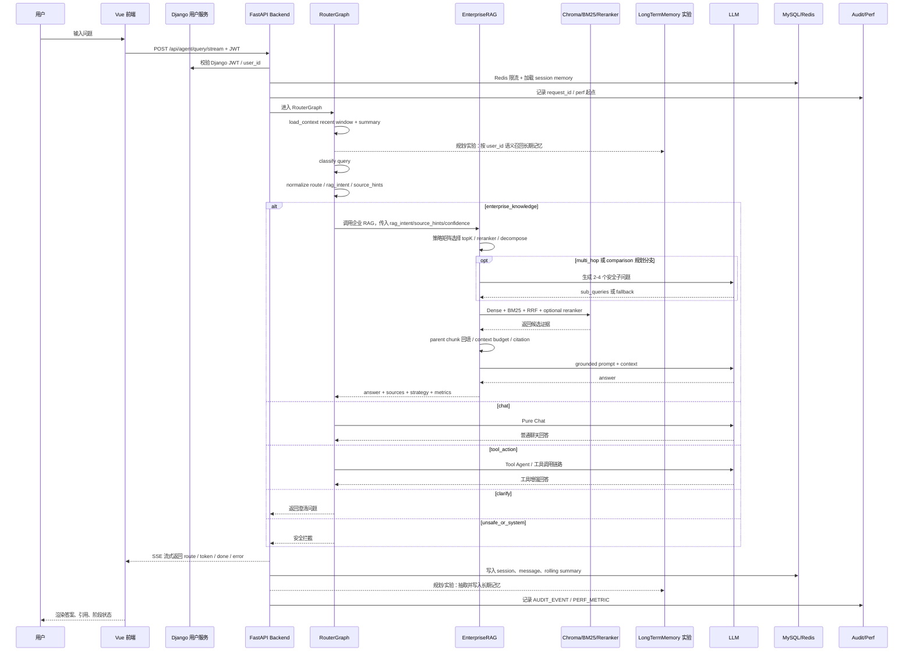

---

## 5. 在线主链路分层

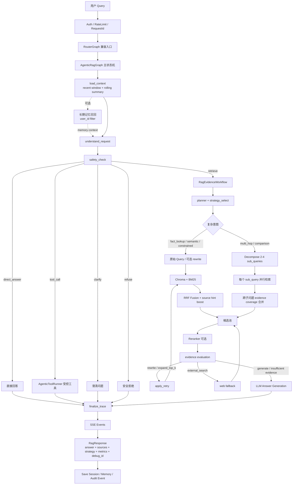

---

## 6. FastAPI backend 内部结构

```text
backend/
├── main.py                         # FastAPI app 创建、注册 router、中间件、启动 Redis/MySQL
├── app/
│   ├── router/
│   │   ├── chat.py                 # /api/agent/query/stream 等主入口
│   │   ├── chat_service.py         # API 业务编排层
│   │   ├── health.py               # 健康检查
│   │   └── user.py                 # FastAPI 侧用户详情接口
│   │
│   ├── agent/
│   │   ├── router_graph.py         # RouterGraph 兼容入口，委托 AgenticRagGraph
│   │   ├── agent.py                # Tool Agent / 普通 Agent 能力
│   │   ├── agent_tools.py          # 受控工具集合
│   │   └── agent_middleware.py
│   │
│   ├── rag/
│   │   ├── agentic_rag_graph.py      # LangGraph 主状态机
│   │   ├── rag_evidence_workflow.py  # 企业 RAG 证据工作流
│   │   ├── retrieval_pipeline.py     # Chroma + BM25 + RRF 检索流水线
│   │   ├── strategy_router.py        # reranker / decompose / retry / web fallback 策略
│   │   ├── decomposition.py          # multi-hop / comparison 问题分解
│   │   ├── graph_extraction.py       # 实体关系抽取
│   │   ├── graph_index_service.py    # 图谱索引构建与查询支撑
│   │   ├── web_search.py             # 外部搜索回退
│   │   ├── enterprise_rag_service.py # 企业评测知识库 RAG 服务
│   │   ├── enterprise_rag_graph.py   # 兼容包装
│   │   ├── rag_service.py            # 原业务知识库 RAG
│   │   ├── vector_store.py           # Chroma 向量库和文档入库
│   │   ├── reorder_service.py        # Qwen3-Reranker
│   │   └── text_spliter.py           # 文本切分
│   │
│   ├── services/
│   │   ├── database_session_manager.py # 会话/消息持久化
│   │   ├── conversation_memory.py      # recent window + rolling summary
│   │   ├── long_term_memory.py         # 长期记忆抽取、去重和召回
│   │   └── rag_debug_trace_store.py    # RAG debug trace 存储
│   │
│   ├── schemas/
│   │   ├── models.py                # 通用 Pydantic 请求/响应模型
│   │   ├── rag.py                   # RAG Response Schema
│   │   ├── rag_debug.py             # RAG Debug Trace Schema
│   │   └── sse.py                   # SSE Event Schema
│   │
│   ├── models/                      # ChatSession / ChatMessage / ChatSessionMemory / LongTermMemory
│   ├── db/                          # MySQL async SQLAlchemy 与 Redis 连接
│   ├── core/                        # 限流、审计、性能日志、统一响应和异常处理
│   ├── cache/                       # Redis 缓存封装
│   ├── config/                      # rag.yaml / chroma.yaml / prompt.yaml / agent.yaml
│   ├── prompt/                      # Prompt 模板
│   └── utils/                       # JWT 校验、LLM/Embedding 工厂、文件处理和配置读取
│
├── scripts/
│   ├── prepare_enterprise_rag_bench.py          # 准备 EnterpriseRAG-Bench parent/child chunks
│   ├── index_enterprise_chunks_chroma.py        # 建 Chroma 索引
│   ├── index_enterprise_chunks_elasticsearch.py # 建 Elasticsearch 索引
│   ├── index_enterprise_graph.py                # 建 Graph Index
│   ├── evaluate_enterprise_retrieval.py         # Dense / BM25 / RRF / reranker 检索评测
│   ├── evaluate_enterprise_rag_generation.py    # 生成质量评测
│   ├── evaluate_long_term_memory.py             # 长期记忆 E2E 评测
│   └── memory_eval_golden_cases.jsonl           # 长期记忆黄金样例
│
├── data/                            # 本地索引、评测输出和运行数据
└── tests/                           # 后端测试
```

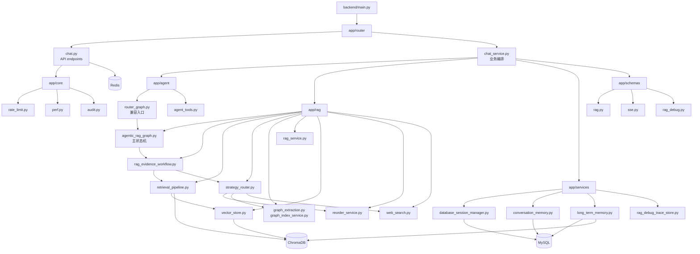

### 6.1 FastAPI API 与模块对应关系

```mermaid
flowchart TD
    API[FastAPI /api] --> Stream[/agent/query/stream]
    API --> RouterQuery[/agent/router/query]
    API --> ClassicRag[/rag/query]
    API --> SessionAPI[/session/{id}<br/>/sessions]
    API --> VectorAPI[/vector/add<br/>/vector/clean]
    API --> RerankAPI[/reorder]
    API --> MemoryAPI[/memories<br/>/memories/{id}]
    API -.后续扩展.-> MemorySearchAPI[/memories/search]

    Stream --> RG[RouterGraph.stream]
    RouterQuery --> RGI[RouterGraph.invoke]
    ClassicRag --> Classic[RagService]
    SessionAPI --> SM[database_session_manager]
    VectorAPI --> VS[VectorStoreService]
    RerankAPI --> RK[reorder_service]
    MemoryAPI --> LTM[long_term_memory_service]
    MemorySearchAPI --> LTM

    RG --> AG[AgenticRagGraph]
    AG --> WF[RagEvidenceWorkflow]
    AG --> PC[direct_answer]
    AG --> TA[AgenticToolRunner]
    AG --> PM[persist_message]
    WF --> ER[EnterpriseRagService]

    PM --> MySQL[(MySQL ChatSession / ChatMessage / ChatSessionMemory)]
    LTM --> LTMDB[(MySQL long_term_memories 规划)]
    LTM --> LTMV[(Chroma long_term_memories)]
```

| API / 模块 | 当前作用 | 状态 |
| --- | --- | --- |
| `/api/agent/query/stream` | 统一在线聊天入口，SSE 返回 | 已落地 |
| `/api/agent/router/query` | 非流式 RouterGraph 调试/评测入口 | 已落地 |
| `/api/rag/query` | 经典上传文档 RAG 入口 | 已落地 |
| `/api/vector/*` | 上传文档向量化、清理用户向量 | 已落地 |
| `/api/reorder` | 独立重排序调试接口 | 已落地 |
| `/api/memories`、`/api/memories/{id}` | 长期记忆列表、删除 | 已落地 |
| `/api/memories/search` | 长期记忆独立语义搜索端点 | 后续扩展；当前问答链路内部调用长期记忆搜索 |

---

## 7. AgenticRagGraph 状态机

`RouterGraph` 现在是兼容入口；在线问答的“大脑”是 `AgenticRagGraph`，它负责从请求上下文、长期记忆和行动决策中选择下一步。

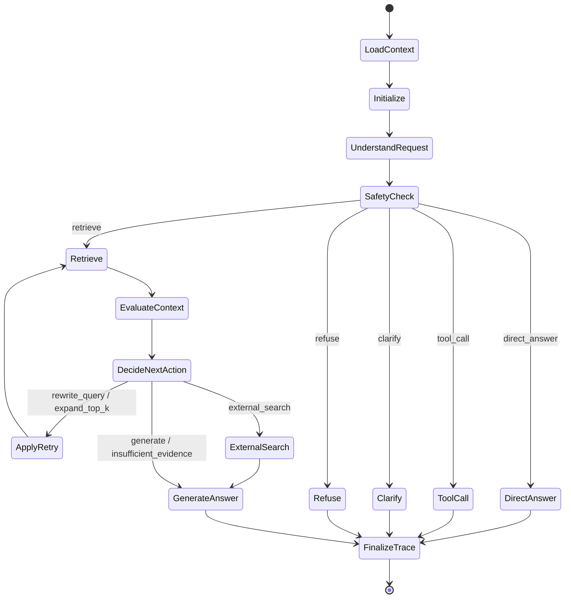

Agentic 决策输出可以理解成：

```text
AgenticActionDecision
├── intent / rag_intent: fact_lookup / semantic_query / multi_hop / comparison / procedure / constrained / follow_up / unknown
├── action: direct_answer / retrieve / tool_call / clarify / refuse
├── needs_retrieval / needs_tool / needs_clarification / safety_risk
├── source_hints: confluence / jira / slack / github / google_drive / linear / gmail / hubspot / fireflies
├── required_tools: 需要执行的受控工具
├── confidence: 置信度
└── reason: 为什么这样行动
```

`RagEvidenceWorkflow` 根据 `rag_intent` 和 `confidence` 选择检索策略；`RouterGraph.stream()` 仅把结果包装成旧前端仍能消费的 SSE 事件。

---

## 8. AgenticRagGraph 五个 action

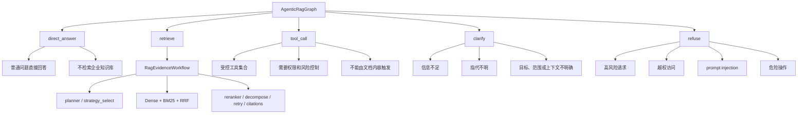

---

## 9. RagEvidenceWorkflow Pipeline

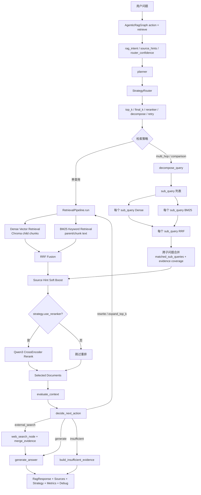

关键理解：

| 组件 | 解决的问题 |
| --- | --- |
| child chunk | 精准召回 |
| parent chunk | 补完整上下文，避免断章取义 |
| Dense Retrieval | 语义相似、同义表达 |
| BM25 | 编号、术语、制度条款、接口名等精确匹配 |
| RRF | 融合不同检索器，避免分数尺度不可比 |
| Reranker | 提升 Top1 / MRR，但会增加延迟 |
| Decompose | 复杂多跳/对比问题拆成多个可检索子问题，避免单个高分证据挤掉必要证据 |
| Evidence Coverage | 跨子问题合并时优先覆盖不同证据组 |
| Citation | 答案可追溯、可验证 |

---

## 10. Dense + BM25 + RRF + Reranker 局部结构

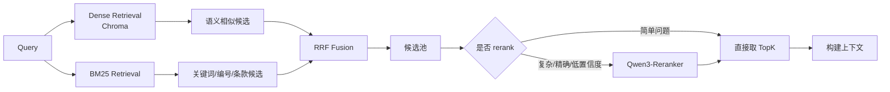

---

## 11. Agentic 策略矩阵

Agentic 不是“让 Agent 随便行动”，而是让 `AgenticRagGraph` 在受控 action 和 RAG 策略矩阵内行动。

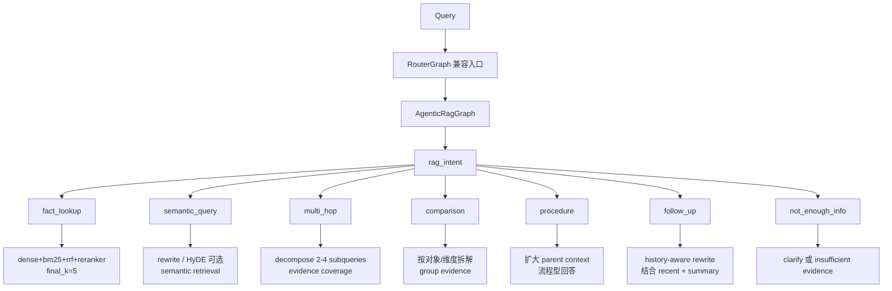

| rag_intent | 典型问题 | 推荐策略 |
| --- | --- | --- |
| `fact_lookup` | “试用期请假规则是什么？” | Dense + BM25 + RRF + reranker |
| `semantic_query` | “这个制度大概怎么规定的？” | rewrite / HyDE 可选 |
| `multi_hop` | “满足 A 后再走 B 的流程是什么？” | decompose + 多证据覆盖 |
| `comparison` | “试用期和正式员工有什么区别？” | 按对象/维度拆子问题 |
| `procedure` | “报销流程怎么走？” | parent chunk 更重要 |
| `follow_up` | “刚才那个方案有什么风险？” | history-aware rewrite |
| `not_enough_info` | “帮我查一下这个” | 澄清 |

---

## 12. 多跳 / 对比问题 Decompose

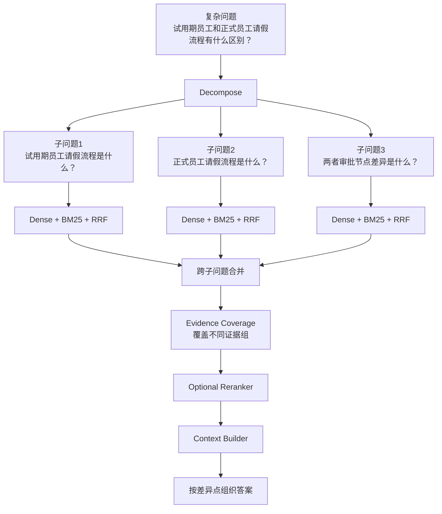

约束原则：

```text
1. 只在 multi_hop / comparison 等复杂问题上启用。
2. 子问题数量控制在 2 到 4 个。
3. 子问题必须继承原始实体、时间范围、source_hints 和 metadata_filters。
4. 子问题不能引入原始问题之外的新事实假设。
5. 跨子问题合并时关注 evidence coverage，不能只取单个高分子问题结果。
6. 拆解失败时回退到原始 query 检索。
```

---

## 13. 会话记忆与长期记忆 Memory

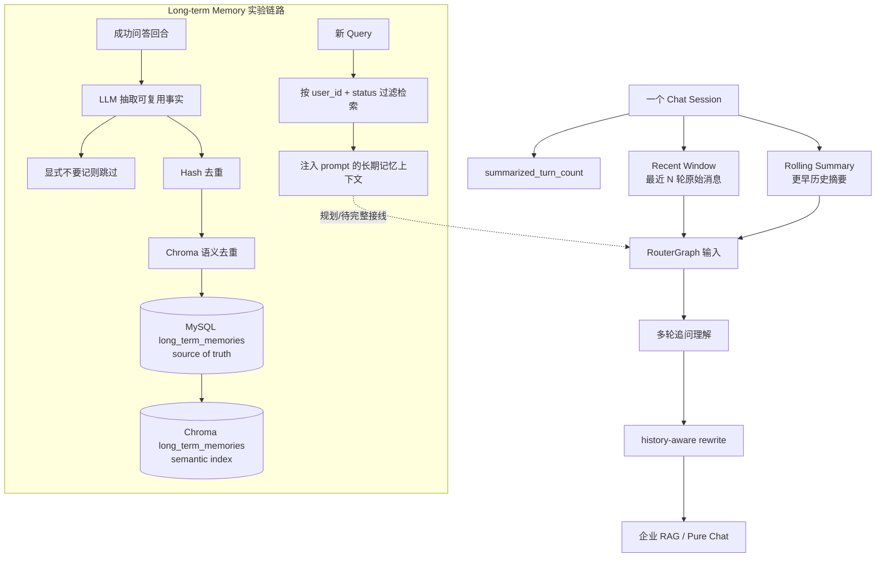

```text
ChatSession
├── ChatMessage[]
│   ├── role: user / assistant
│   ├── content
│   ├── created_at
│   └── status / metadata
│
├── ChatSessionMemory
│   ├── summary               # 早期对话压缩
│   ├── summarized_turn_count # 摘要覆盖到第几轮
│   └── updated_at
│
└── LongTermMemory（规划/实验）
    ├── memory                # 用户偏好、项目背景、决策等事实
    ├── memory_type           # preference/profile/project/decision/task/other
    ├── hash                  # 精确去重
    ├── metadata              # reason/confidence 等
    ├── status                # active/deleted
    └── Chroma metadata       # memory_id/user_id/session_id/status
```

| 记忆类型 | 作用 | 隔离方式 |
| --- | --- | --- |
| Recent Window | 保留最近细节，处理“刚才那个方案” | `session_id + user_id` |
| Rolling Summary | 压缩长历史，控制 prompt 长度 | `session_id + user_id` |
| Long-term Memory | 跨会话复用稳定偏好、项目背景和决策 | `user_id + status` 过滤 |
| summarized_turn_count | 避免重复摘要或漏摘要 | 与 ChatSessionMemory 同表记录 |
| Hash / Semantic Duplicate | 避免重复写入同一条长期记忆 | hash + Chroma 相似度 |

---

## 14. SSE 流式返回

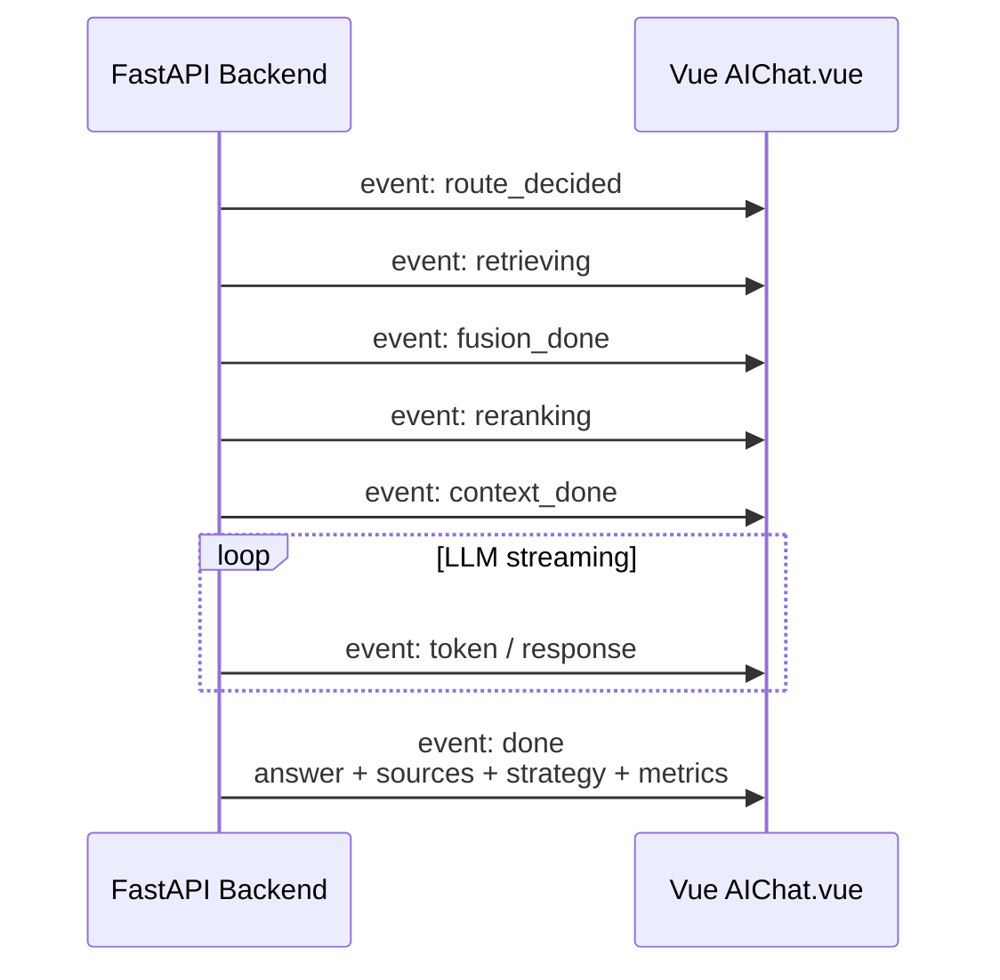

目标事件结构：

```text
SseEvent
├── event: route_decided / retrieving / token / done / error
├── request_id
├── session_id
├── stage
├── message
├── data
└── timestamp
```

最终 `done` 里建议包含：

```text
RagResponse
├── request_id
├── session_id
├── answer
├── sources[]
├── strategy
├── metrics
├── debug_id
└── warnings[]
```

---

## 15. RagResponse / Sources / Metrics

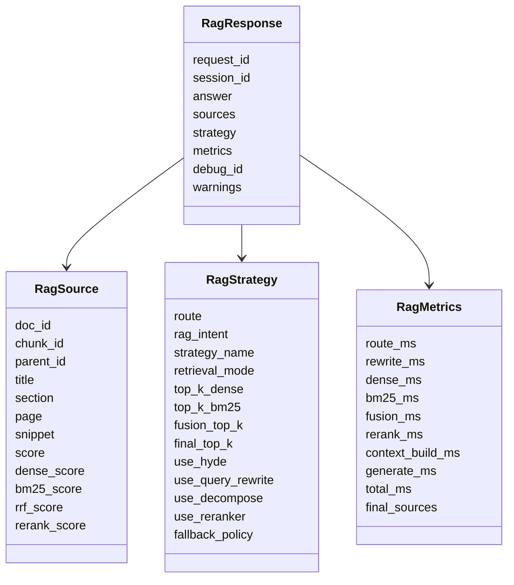

| 字段 | 价值 |
| --- | --- |
| sources | 答案可追溯 |
| strategy | 知道本次用了什么策略 |
| metrics | 性能瓶颈可定位 |
| debug_id | 线上排障可回溯 |
| warnings | 资料不足、权限过滤、疑似 injection 等提示 |

---

## 16. 数据存储结构

```mermaid
flowchart TD
    subgraph MySQL[MySQL]
        U[User<br/>Django 用户表]
        CS[ChatSession]
        CM[ChatMessage]
        MEM[ChatSessionMemory]
        LTMDB[LongTermMemory<br/>规划/实验]
        DOC[Document Metadata 可扩展]
    end

    subgraph Redis[Redis]
        BL[JWT Blacklist]
        RL[Rate Limit Counter]
        CACHE[User / Config / Hot Cache]
    end

    subgraph Chroma[ChromaDB]
        V1[Uploaded Docs Collection]
        V2[EnterpriseRAG-Bench Parent-Child Collection]
        V3[Long-term Memory Collection 实验]
    end

    subgraph FileStore[本地/文件存储]
        UP[上传文件]
        DATA[EnterpriseRAG-Bench JSONL]
        MODEL[Qwen3-Reranker 权重]
    end

    FastAPI[FastAPI Backend] --> CS
    FastAPI --> CM
    FastAPI --> MEM
    FastAPI -.规划/实验.-> LTMDB
    FastAPI --> BL
    FastAPI --> RL
    FastAPI --> V1
    FastAPI --> V2
    FastAPI -.规划/实验.-> V3

    Django[Django User Service] --> U
    Django --> BL
    Django --> UP
```

| 存储 | 放什么 |
| --- | --- |
| MySQL | 用户、会话、消息、摘要记忆、长期记忆 source of truth、文档元信息 |
| Redis | 限流、缓存、JWT 黑名单 |
| ChromaDB | 上传文档 chunk embedding、EnterpriseRAG-Bench parent-child chunk、长期记忆语义索引 |
| 本地文件 | 上传文档、EnterpriseRAG-Bench JSONL、parent/child chunks、模型权重 |

---

## 17. 文档入库 / 向量化链路

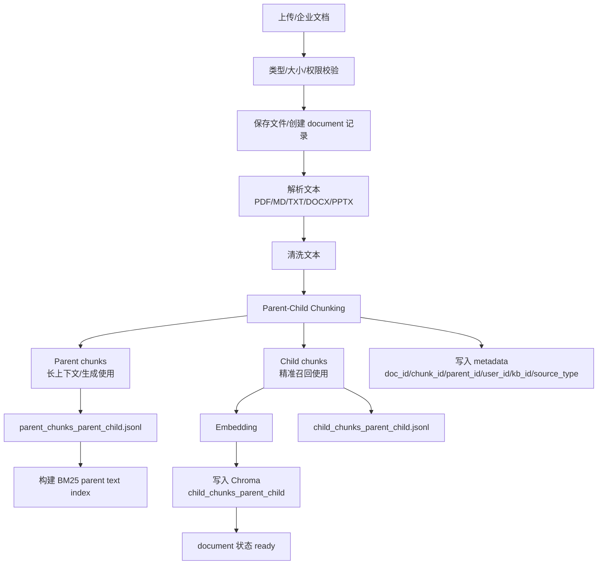

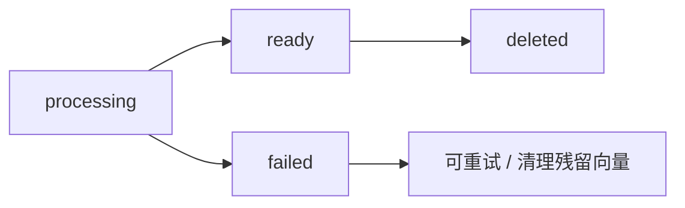

---

## 18. 前端 front 结构

```text
front/
├── src/
│   ├── main.js                 # Vue app 初始化
│   ├── App.vue                 # 根组件
│   ├── router/
│   │   └── index.js            # /login /register /aichat /sessions /my 等路由
│   ├── store/
│   │   ├── user.js             # 登录、注册、JWT、用户资料
│   │   ├── session.js          # 会话列表、会话详情、SSE 聊天
│   │   └── index.js            # Pinia 初始化
│   ├── views/
│   │   ├── Login.vue
│   │   ├── Register.vue
│   │   ├── AIChat.vue          # 主聊天页
│   │   ├── Sessions.vue        # 会话列表
│   │   ├── My.vue              # 个人中心
│   │   ├── Profile.vue         # 资料编辑/头像
│   │   └── Settings.vue
│   ├── components/
│   │   └── TabBar.vue
│   └── config/
│       └── api.js              # API endpoint 常量
└── vite.config.js              # dev server + proxy
```

```mermaid
flowchart TD
    Login[Login.vue] --> UserStore[user.js]
    Register[Register.vue] --> UserStore
    Profile[Profile.vue] --> UserStore

    UserStore --> DjangoAPI[/user/login<br/>/user/register<br/>/user/detail]

    AIChat[AIChat.vue] --> SessionStore[session.js]
    Sessions[Sessions.vue] --> SessionStore

    SessionStore --> FastAPI[/api/agent/query/stream<br/>/api/session/{id}<br/>/api/sessions/{user_id}]

    FastAPI --> SSE[SSE 流]
    SSE --> AIChat
```

---

## 19. DjangoUserService 结构

```text
DjangoUserService/
├── manage.py
├── DjangoUserService/
│   ├── settings.py             # MySQL、Redis、DRF、JWT auth、CORS
│   └── urls.py                 # /user/ /file/ /docs/
└── apps/
    ├── user/
    │   ├── models.py           # 自定义 User，uuid 主键
    │   ├── serializers.py      # Login/Register/UserUpdate/Password
    │   ├── views.py            # 登录、注册、详情、更新、刷新 token、退出
    │   ├── urls.py
    │   └── authentications.py  # JWTAuthentication
    │
    └── file/
        ├── views.py            # /file/upload/
        ├── serializers.py      # 图片校验
        └── urls.py
```

```mermaid
sequenceDiagram
    participant F as Vue
    participant D as Django User Service
    participant R as Redis
    participant M as MySQL
    participant B as FastAPI

    F->>D: /user/login username/password
    D->>M: 查询用户
    D->>D: 校验密码
    D->>F: 返回 JWT

    F->>B: /api/agent/query/stream + JWT
    B->>B: 解码 JWT
    B->>R: 检查 jti 是否黑名单
    B->>B: 提取 user_id
    B->>F: SSE 回答

    F->>D: /user/logout
    D->>R: 写入 jti 黑名单
```

---

## 20. 离线评测链路

```mermaid
flowchart TD
    Dataset[EnterpriseRAG-Bench / 人工样例] --> Prep[prepare_enterprise_rag_bench.py]
    Prep --> Chunks[parent chunks / child chunks]
    Chunks --> Index[index_enterprise_chunks_chroma.py]
    Index --> Chroma[Chroma Parent-Child Collection]

    Dataset --> Eval[evaluate_enterprise_hybrid_retrieval.py]
    Chroma --> Eval
    BM25[BM25 Parent Text Index] --> Eval
    Reranker[Qwen3-Reranker] --> Eval
    Decomp[策略矩阵 / Decompose 评测方法] --> Eval

    Eval --> Metrics[Hit@K / Recall@K / MRR / Evidence Coverage / Latency]
    Eval --> Failures[失败样例 JSONL]
    Failures --> Analyze[归因分析]
    Analyze --> Strategy[调整 chunk/topK/reranker/HyDE/decompose]
    Strategy --> Eval

    MemoryCases[memory_eval_golden_cases.jsonl] --> MemoryEval[evaluate_long_term_memory.py]
    MemoryEval --> MemoryMetrics[Memory Recall / Cross-session Answer Hit / Isolation]
    MemoryEval -.内部服务召回.-> MemorySvc[long_term_memory_service.search]
    MemoryEval -.公开接口.-> MemoryAPI[/api/memories / delete]
```

```mermaid
flowchart LR
    Eval[评测体系] --> Retrieval[检索指标]
    Eval --> Citation[引用指标]
    Eval --> Answer[生成指标]
    Eval --> Latency[性能指标]
    Eval --> Failure[失败归因]
    Eval --> MemoryE[长期记忆指标]

    Retrieval --> H[Hit@K]
    Retrieval --> R[Recall@K]
    Retrieval --> M[MRR@K]
    Retrieval --> E[Evidence Coverage@K]
    Retrieval --> DC[Decompose Partial Evidence]

    Citation --> CA[Citation Accuracy]
    Citation --> CG[Citation Grounding]

    Answer --> AF[Answer Faithfulness]
    Answer --> UC[Unsupported Claims]

    Latency --> AVG[avg]
    Latency --> P50[p50]
    Latency --> P95[p95]
    Latency --> Stage[route/rewrite/retrieve/rerank/generate]

    Failure --> F1[missed_all_gold]
    Failure --> F2[reranker_top1_not_gold]
    Failure --> F3[context_budget_dropped_gold]
    Failure --> F4[decompose_partial_evidence]

    MemoryE --> MR[Memory Recall]
    MemoryE --> CAH[Cross-session Answer Hit]
    MemoryE --> ISO[User Isolation]
```

---

## 21. 企业 RAG 安全边界

```mermaid
flowchart TD
    User[用户请求] --> Auth[JWT 鉴权]
    Auth --> UserID[current_user_id]

    UserID --> Filter1[检索前 metadata filter<br/>user_id / tenant_id / knowledge_base_id]
    Filter1 --> Retrieval[Dense / BM25 Retrieval]
    UserID --> MemoryFilter[长期记忆检索 filter<br/>user_id + active]

    Retrieval --> Filter2[检索后二次权限过滤]
    Filter2 --> Fusion[RRF Fusion]
    Fusion --> Filter3[rerank 前后过滤]
    Filter3 --> Context[Context Builder]
    MemoryFilter -.规划/实验.-> Context
    Context --> Filter4[sources 返回前过滤]

    Context --> Prompt[Prompt 中标记 context 为 untrusted]
    Prompt --> LLM[LLM]

    LLM --> Answer[答案]
    Filter4 --> Sources[安全 sources]

    User --> Audit[Audit Event]
    Filter2 --> Audit
    Filter4 --> Audit
    MemoryFilter --> Audit
```

安全重点：

```text
1. FastAPI 只信 JWT claims，不信前端传来的 user_id。
2. 检索必须带 metadata filter。
3. retrieved / fused / reranked / context / sources 都要二次权限过滤。
4. 文档内容是 untrusted context，不能覆盖系统指令。
5. RAG 文档不能触发工具调用。
6. sources 不返回 owner_user_id、绝对路径、raw metadata、完整原文。
7. 长期记忆只按当前 `user_id` 检索和管理，删除采用 active/deleted 状态隔离。
8. 日志不能记录 token、API key、完整 prompt；审计日志用 `audit.py` 做字段脱敏和长文本摘要。
9. 关键行为写 AUDIT_EVENT。
```

---

## 22. 项目讲述大纲图

```mermaid
flowchart TD
    A[项目背景<br/>企业知识分散，普通 RAG 容易错] --> B[整体架构<br/>Vue + Django + FastAPI + MySQL/Redis/Chroma]
    B --> C[在线主链路<br/>JWT → RouterGraph → RAG/Chat/Tool/Safety → SSE]
    C --> D[RAG 核心优化<br/>Parent-child chunk + Dense/BM25/RRF + Reranker + Citation]
    D --> E[Agentic RAG<br/>RouterGraph 输出 rag_intent 和 strategy matrix]
    E --> ED[Decompose 规划<br/>multi_hop/comparison 子问题拆解]
    ED --> F[Memory<br/>recent window + rolling summary + 长期记忆实验]
    F --> G[评测闭环<br/>Hit@K/Recall/MRR/Evidence Coverage/Memory Recall/Latency]
    G --> H[工程化<br/>SSE、Session、PERF_METRIC、Debug、Audit]
    H --> I[安全边界<br/>JWT、ACL、prompt injection、sources 脱敏]
```

---

## 23. 推荐阅读代码顺序

```mermaid
flowchart TD
    S1[1. 先看整体服务关系<br/>front / Django / backend] --> S2[2. 看一次请求怎么走<br/>/api/agent/query/stream]
    S2 --> S3[3. 看 AgenticRagGraph 五个 action]
    S3 --> S4[4. 深看 RagEvidenceWorkflow Pipeline]
    S4 --> S5[5. 理解 Dense + BM25 + RRF + Reranker]
    S5 --> S6[6. 理解 Memory 和 Session]
    S6 --> S7[7. 看长期记忆实验和审计]
    S7 --> S8[8. 看评测脚本和指标]
    S8 --> S9[9. 补安全边界和生产化不足]
```

对应代码入口：

```text
1. FastAPI 入口
   backend/main.py

2. 聊天 API
   backend/app/router/chat.py

3. RouterGraph
   backend/app/agent/router_graph.py

4. 企业 RAG
   backend/app/rag/enterprise_rag_service.py

5. 经典 RAG / 上传文档 RAG
   backend/app/rag/rag_service.py
   backend/app/rag/vector_store.py

6. Reranker
   backend/app/rag/reorder_service.py

7. 会话和记忆
   backend/app/services/database_session_manager.py
   backend/app/services/conversation_memory.py
   backend/app/services/long_term_memory.py

8. 审计和性能埋点
   backend/app/core/audit.py
   backend/app/core/perf.py

9. Django 用户服务
   DjangoUserService/apps/user/views.py
   DjangoUserService/apps/user/authentications.py

10. 前端聊天页
   front/src/views/AIChat.vue
   front/src/store/session.js

11. 评测脚本
   backend/scripts/evaluate_enterprise_hybrid_retrieval.py
   backend/scripts/evaluate_long_term_memory.py
```

---

## 24. 最简记忆版

```text
NexusKB / RAGFlow
├── 前端 front
│   └── 登录、聊天、会话、个人中心
│
├── DjangoUserService
│   └── 用户、JWT、头像、Token 黑名单
│
├── FastAPI backend
│   ├── RouterGraph
│   │   ├── chat
│   │   ├── enterprise_knowledge
│   │   ├── tool_action
│   │   ├── clarify
│   │   └── unsafe_or_system
│   │
│   ├── Enterprise RAG
│   │   ├── Strategy Matrix
│   │   ├── Query Rewrite / HyDE（规划/可选）
│   │   ├── Decompose（multi_hop/comparison 规划）
│   │   ├── Dense Retrieval / Chroma
│   │   ├── BM25
│   │   ├── RRF Fusion
│   │   ├── Evidence Coverage Merge
│   │   ├── Qwen3-Reranker
│   │   ├── Parent Chunk
│   │   ├── Context Compression
│   │   ├── Citation Selection
│   │   └── Grounded Generation
│   │
│   ├── Memory
│   │   ├── recent window
│   │   ├── rolling summary
│   │   └── long-term memory（实验：MySQL + Chroma）
│   │
│   ├── Session
│   │   ├── ChatSession
│   │   └── ChatMessage
│   │
│   └── Evaluation
│       ├── Hit@K
│       ├── Recall@K
│       ├── MRR
│       ├── Evidence Coverage
│       ├── Citation Accuracy
│       ├── Answer Faithfulness
│       ├── Memory Recall
│       └── Latency
│
└── 基础设施
    ├── MySQL
    ├── Redis
    ├── ChromaDB
    ├── Qwen3-Embedding
    ├── Qwen3-Reranker
    ├── EnterpriseRAG-Bench
    └── AUDIT_EVENT / PERF_METRIC
```

---

## 25. 项目说明压缩版

> 我这个项目不是简单向量库问答，而是一个多策略 Agentic RAG 系统。Django 负责用户和 JWT，FastAPI 负责 RouterGraph 和 RAG 主链路，RouterGraph 判断问题类型并输出受控的 `rag_intent`、`source_hints` 和策略配置；企业 RAG 用 parent-child chunk、Dense + BM25 + RRF、条件 reranker 和 citation 保证召回、上下文完整和答案可追溯；复杂多跳/对比问题规划用 decompose 拆成子问题并按 evidence coverage 合并证据；会话记忆用 recent window + rolling summary，长期记忆实验用 MySQL 做事实源、Chroma 做语义索引；最后通过 SSE 返回，并用离线评测、记忆评测、PERF_METRIC 和 AUDIT_EVENT 反哺策略。
