# NexusKB 项目流程图总览

本文档汇总当前 NexusKB 项目的整体运行链路与主要模块流程图。图中按线上请求、后台服务、存储组件、离线索引与评估脚本分层描述，便于快速理解系统边界和模块协作。

## 1. 整体系统流程

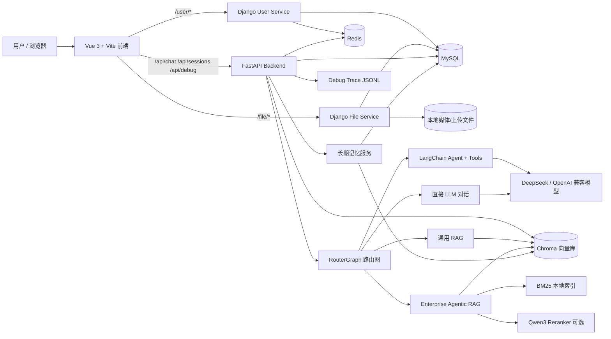

## 2. 在线问答端到端流程

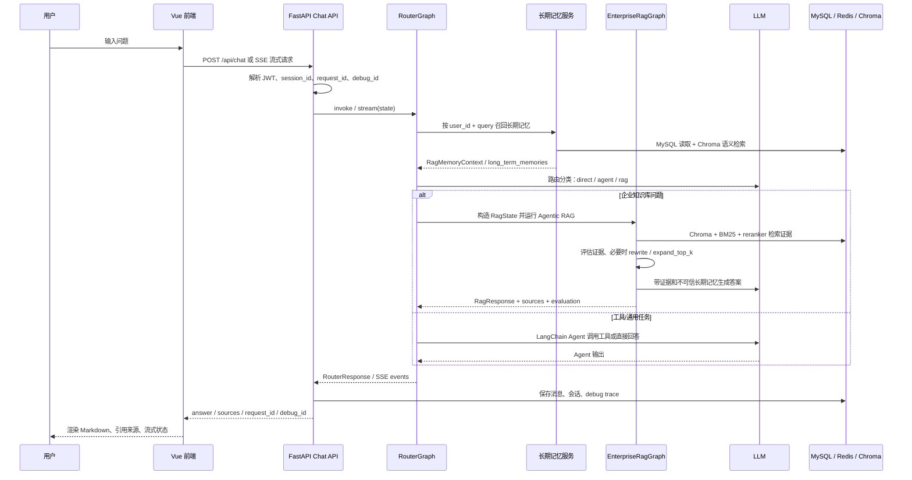

## 3. 前端模块流程

```mermaid
flowchart TD
    Entry[front/src/main.js] --> App[App.vue]
    App --> Router[Vue Router]
    App --> Pinia[Pinia 持久化状态]
    App --> Vant[Vant UI]

    Router --> Login[Login.vue]
    Router --> Register[Register.vue]
    Router --> Chat[AIChat.vue]
    Router --> Sessions[Sessions.vue]
    Router --> Profile[Profile.vue]
    Router --> Settings[Settings.vue]
    Router --> My[My.vue]

    Login --> UserStore[store/user.js]
    Register --> UserStore
    Profile --> UserStore
    My --> UserStore

    Chat --> SessionStore[store/session.js]
    Chat --> ChatAPI[/api/chat]
    Sessions --> SessionAPI[/api/sessions]

    UserStore --> UserAPI[/user/*]
    Profile --> FileAPI[/file/*]

    ChatAPI --> Stream[fetch SSE / 流式响应]
    Stream --> Markdown[marked + highlight.js]
    Markdown --> Sanitize[DOMPurify]
    Sanitize --> Render[聊天消息渲染]

    ViteProxy[Vite proxy] -->|/api| FastAPI[FastAPI]
    ViteProxy -->|/user /file| Django[Django UserService]
```

## 4. Django 用户与文件服务流程

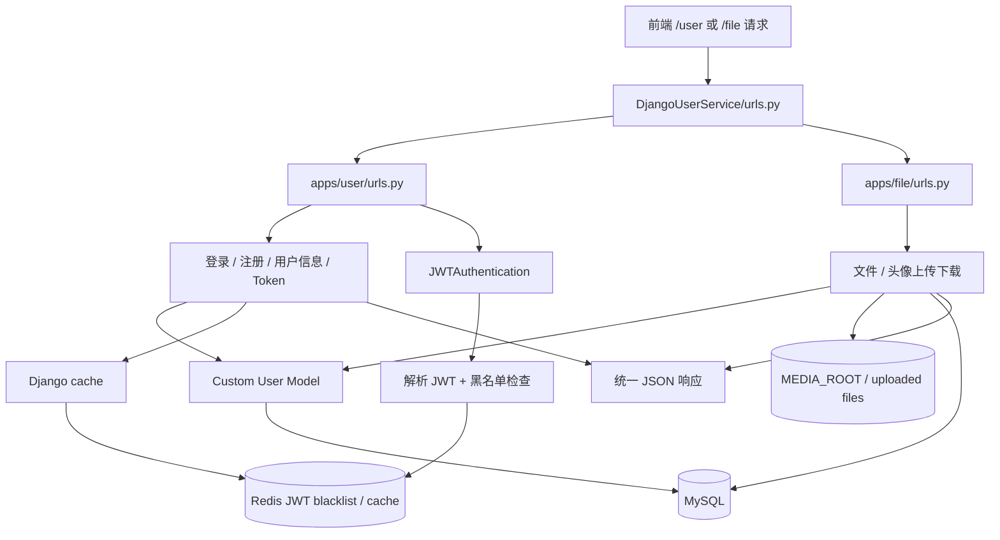

## 5. FastAPI 后端入口与 API 模块流程

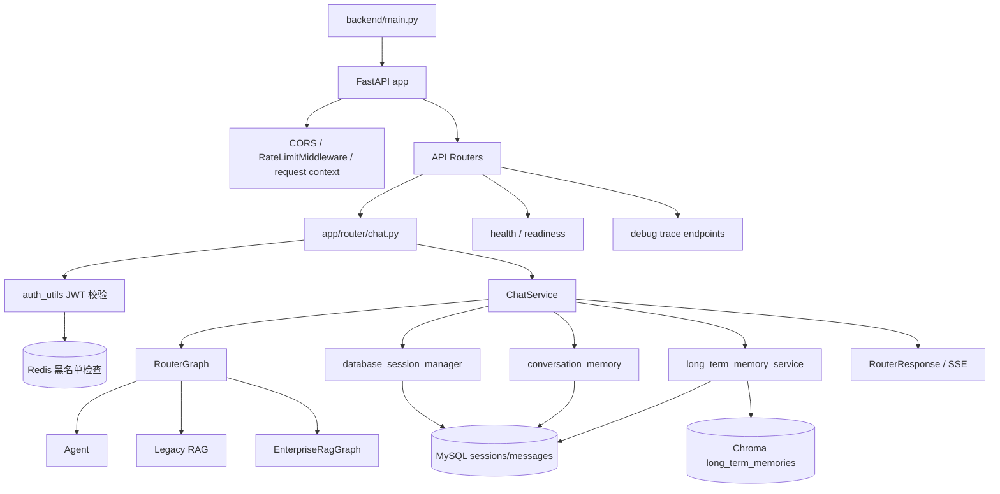

## 6. RouterGraph 路由状态机

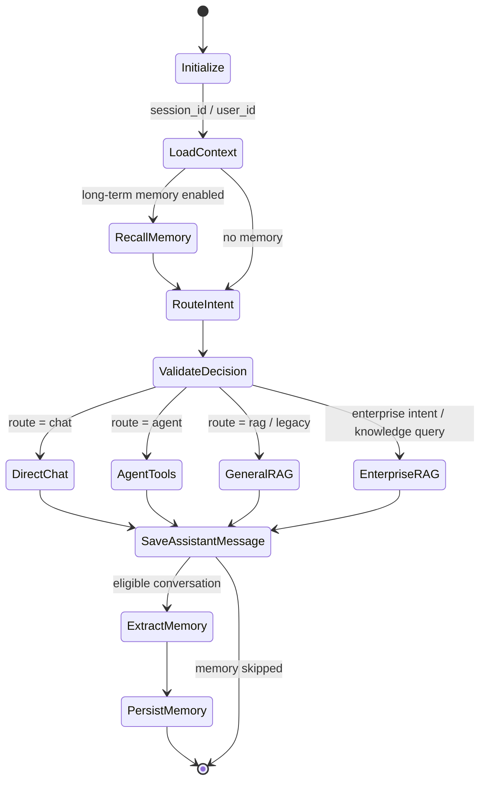

## 7. LangChain Agent 与工具调用流程

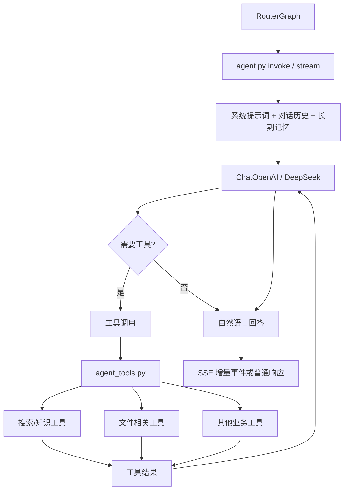

## 8. Enterprise Agentic RAG 流程

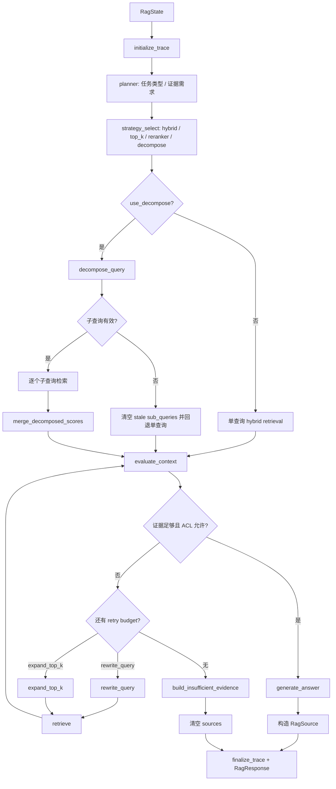

## 9. Enterprise RAG 检索服务流程

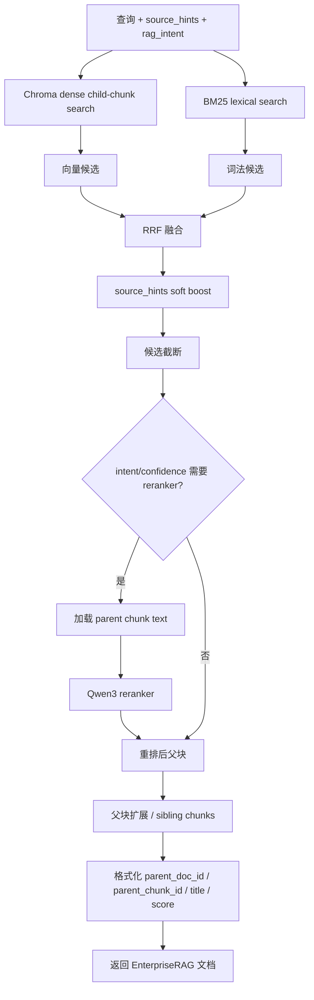

## 10. 通用 RAG 与文档上传流程

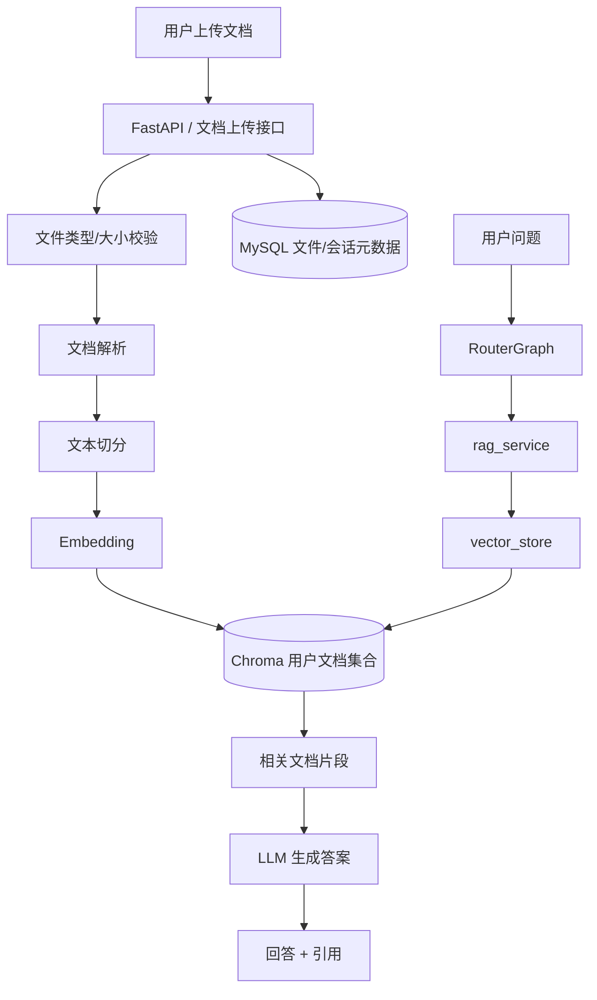

## 11. 长期记忆与会话记忆流程

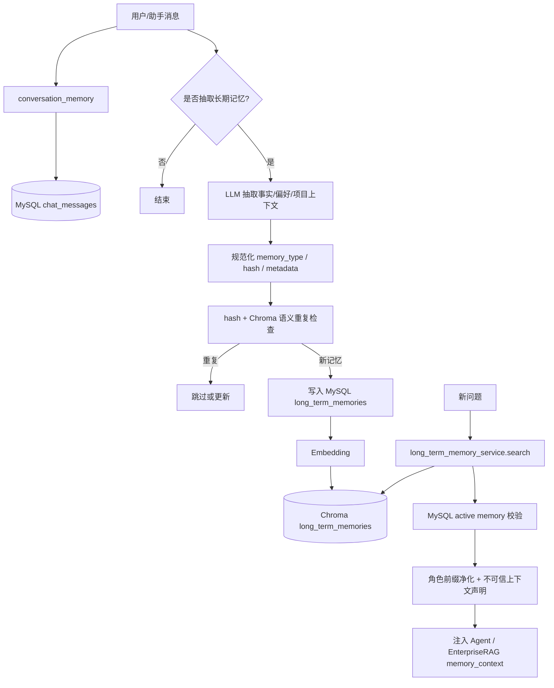

## 12. 数据存储关系流程

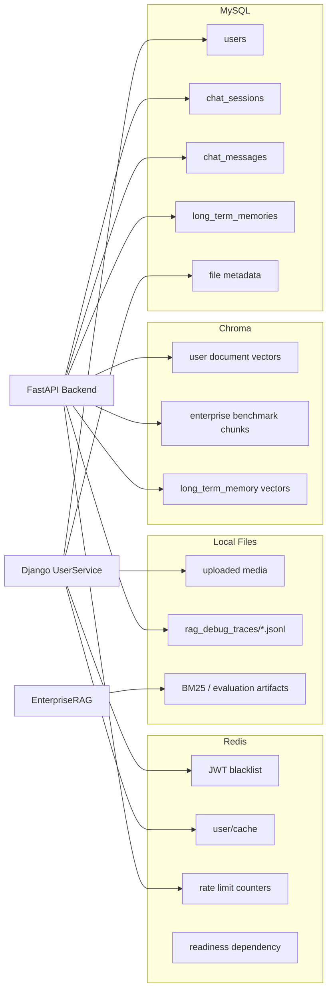

## 13. 离线索引与评估流程

```mermaid
flowchart TD
    SourceDocs[企业文档 / benchmark 原始数据] --> Prepare[prepare_enterprise_rag_bench.py]
    Prepare --> Golden[golden questions / answer facts / evidence groups]
    Prepare --> Chunks[enterprise chunks JSONL]

    Chunks --> IndexChroma[index_enterprise_chunks_chroma.py]
    IndexChroma --> EnterpriseCollection[(Chroma enterprise chunks)]
    Chunks --> BuildBM25[BM25 索引构建]
    BuildBM25 --> BM25Artifacts[(BM25 artifacts)]

    Golden --> EvalHybrid[evaluate_enterprise_hybrid_retrieval.py]
    EnterpriseCollection --> EvalHybrid
    BM25Artifacts --> EvalHybrid
    EvalHybrid --> Metrics[hit@k / precision / recall / f1 / rr / evidence_coverage@k]
    EvalHybrid --> Reports[CSV / JSON summary]

    MemoryCases[memory_eval_golden_cases.jsonl] --> EvalMemory[evaluate_long_term_memory.py]
    EvalMemory --> MemoryMetrics[长期记忆召回/去重/相关性评估]
```

## 14. 启动与开发环境流程

```mermaid
flowchart TD
    Dev[开发者] --> StartScript[start-dev.ps1]
    StartScript --> Env[conda nexuskb / Node / Django settings]

    Env --> StartFastAPI[启动 FastAPI backend]
    Env --> StartDjango[启动 DjangoUserService]
    Env --> StartFrontend[启动 Vite frontend]
    Env --> StartRedis[确认 Redis 可用]
    Env --> StartMySQL[确认 MySQL 可用]
    Env --> StartChroma[确认 Chroma 数据目录/集合]

    StartFastAPI --> BackendHealth[/health]
    StartDjango --> UserHealth[/user endpoints]
    StartFrontend --> Browser[浏览器访问前端]

    Browser --> ViteProxy[Vite proxy]
    ViteProxy --> BackendHealth
    ViteProxy --> UserHealth

    BackendHealth --> Ready{依赖可用?}
    UserHealth --> Ready
    Ready -->|是| DevReady[本地开发可用]
    Ready -->|否| FixDeps[检查 Redis / MySQL / API keys / Chroma]
```

## 15. 安全与失败处理流程

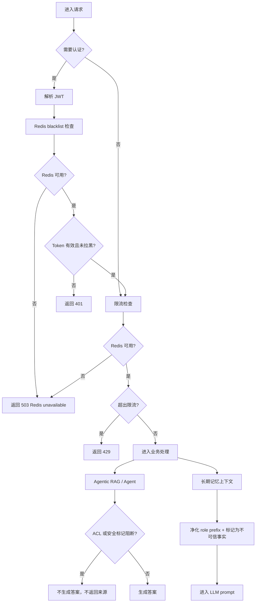

## 16. 模块索引

| 模块 | 主要职责 | 关键入口 |
| --- | --- | --- |
| Frontend | 页面路由、聊天 UI、SSE 渲染、用户状态 | `front/src/main.js`, `front/src/views/AIChat.vue` |
| Django UserService | 注册登录、JWT、用户资料、文件/头像 | `DjangoUserService/DjangoUserService/urls.py` |
| FastAPI Backend | 聊天 API、会话、RAG/Agent 编排、debug trace | `backend/main.py`, `backend/app/router/chat.py` |
| RouterGraph | 意图路由、上下文加载、RAG/Agent 分流 | `backend/app/agent/router_graph.py` |
| Agent | 通用 LLM 对话与工具调用 | `backend/app/agent/agent.py` |
| Enterprise RAG | 企业知识库 agentic 检索、评估、重试、引用 | `backend/app/rag/enterprise_rag_graph.py` |
| RAG Service | 通用文档向量检索和回答 | `backend/app/rag/rag_service.py` |
| Long-term Memory | 用户长期记忆抽取、存储、召回、删除 | `backend/app/services/long_term_memory.py` |
| Conversation Memory | 会话消息与上下文管理 | `backend/app/services/conversation_memory.py` |
| Evaluation Scripts | 企业 RAG、分解检索、长期记忆评估 | `backend/scripts/*.py` |
| Ops / Startup | 本地启动、部署、依赖健康检查 | `start-dev.ps1`, `docs/ops/deployment.md` |
