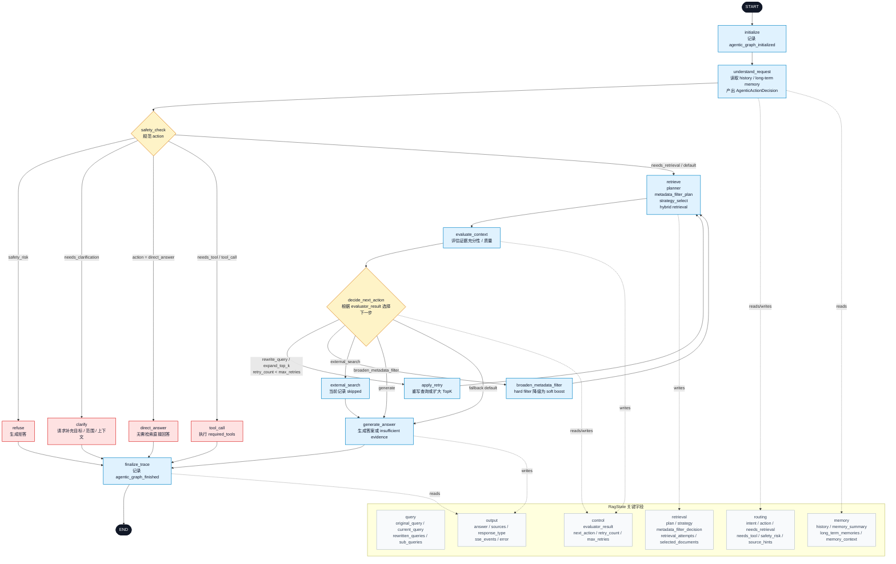

# NexusKB LangGraph 状态图

本文档记录当前 Agentic RAG LangGraph 的控制流与关键 `RagState` 字段。主实现位于 `backend/app/rag/agentic_rag_graph.py`。

## 面试讲解口径

这张图体现的是 NexusKB 当前 Agentic RAG 的状态机式编排：请求进入后先初始化 trace，再结合短期对话历史和长期记忆完成意图理解；`safety_check` 负责将请求路由到直接回答、澄清、拒答、工具调用或知识库检索。检索主链路会执行规划、元数据过滤规划、策略选择和混合检索，随后评估上下文证据质量，并根据 `next_action` 决定是否重写查询、扩大 TopK、放宽 metadata filter，或进入最终答案生成。

关键点不是简单串联 RAG chain，而是把请求路由、检索重试、证据评估、答案生成和 trace 记录都放进统一的 `RagState` 中，使 Agent 执行过程可观察、可调试、可扩展。
