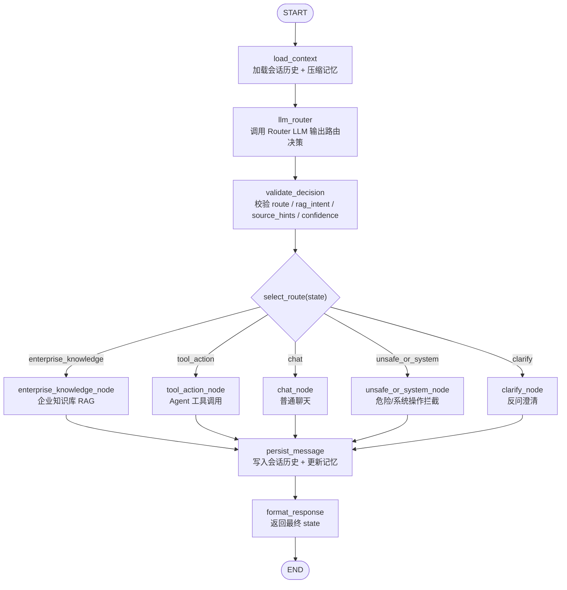
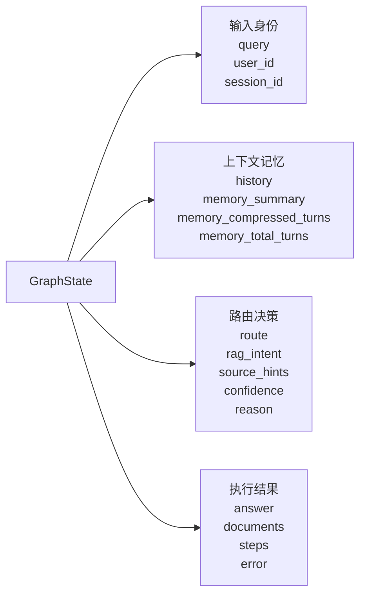
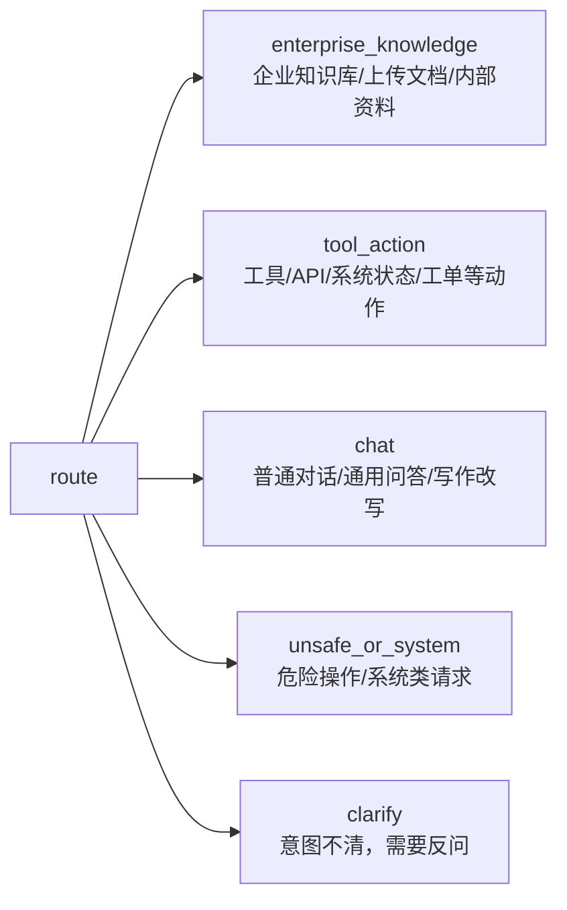
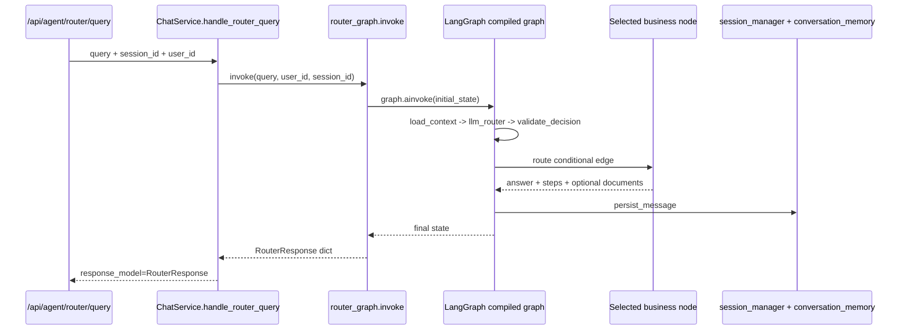
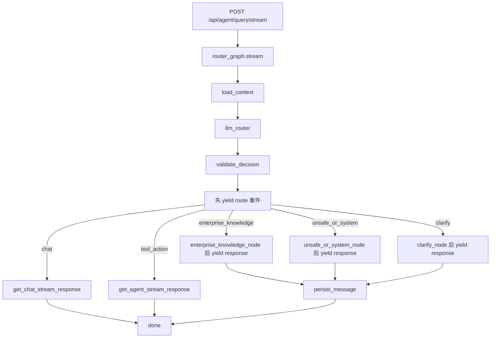

# LangGraph RouterGraph 可视化

本文档描述当前后端 `RouterGraph` 的 LangGraph 节点设计、状态流转和入口位置。

## 代码位置

- RouterGraph 主实现：`backend/app/agent/router_graph.py`
- State 定义：`backend/app/agent/router_graph.py:86`
- Graph 构建：`backend/app/agent/router_graph.py:175`
- 非流式入口：`backend/app/router/chat_service.py:27`
- SSE 流式入口：`backend/app/router/chat.py:27`

## 整体框架图



## GraphState 定义

`GraphState` 是 LangGraph 节点之间传递的共享状态，定义在：

`backend/app/agent/router_graph.py:86`

```python
class GraphState(TypedDict):
    query: str
    user_id: str
    session_id: str
    history: NotRequired[list[tuple[str, str]]]
    memory_summary: NotRequired[str]
    memory_compressed_turns: NotRequired[int]
    memory_total_turns: NotRequired[int]
    route: NotRequired[str]
    rag_intent: NotRequired[str]
    source_hints: NotRequired[list[str]]
    confidence: NotRequired[float]
    reason: NotRequired[str]
    answer: NotRequired[str]
    documents: NotRequired[list[Any]]
    steps: NotRequired[list[dict[str, Any]]]
    error: NotRequired[str | None]
```

## State 分层视图



## 节点职责

| 节点 | 主要职责 | 输入重点 | 输出重点 |
|---|---|---|---|
| `load_context` | 加载会话上下文，优先读取压缩记忆，失败时回退完整历史 | `session_id`, `user_id` | `history`, `memory_summary`, `memory_*` |
| `llm_router` | 调用 Router LLM，只做分类，不回答问题 | `query`, `history` | `route`, `rag_intent`, `source_hints`, `confidence`, `reason` |
| `validate_decision` | 归一化和校验 LLM 路由输出 | Router LLM 输出 | 安全可控的路由字段 |
| `enterprise_knowledge_node` | 调用企业知识库检索和总结 | `query`, `rag_intent`, `source_hints`, `confidence` | `answer`, `documents`, `steps` |
| `tool_action_node` | 调用 Agent 工具链 | `query`, `history` | `answer`, `steps` |
| `chat_node` | 普通聊天回答 | `query`, `history` | `answer`, `steps` |
| `unsafe_or_system_node` | 对删除、清空、重置等危险/系统请求保守拦截 | `route` | 确认提示 |
| `clarify_node` | 对低置信度或意图不清请求反问 | `route`, `confidence` | 澄清问题 |
| `persist_message` | 写入 MySQL 会话历史并更新 conversation memory | `query`, `answer` | 无业务输出 |
| `format_response` | 返回最终 state | 完整 state | 完整 state |

## 路由枚举

当前允许的顶层 `route`：



兼容旧命名的位置在 `backend/app/agent/router_graph.py:47`：

```python
LEGACY_ROUTE_ALIASES = {
    "rag_query": "enterprise_knowledge",
    "agent_tool_call": "tool_action",
    "system": "unsafe_or_system",
}
```

## 非流式调用链路



## SSE 流式调用链路

当前 `/api/agent/query/stream` 也会先经过 RouterGraph：

`backend/app/router/chat.py:37`

```python
router_graph.stream(request.query, user_id, session_id)
```

流式路径没有直接使用 `graph.astream()`，而是在 `RouterGraph.stream()` 中手动执行前三个路由节点，然后按 route 分支输出 SSE：



## 当前设计要点

1. `RouterGraph` 是一层调度图，不重写底层 RAG、Agent 或 Chat 能力。
2. `llm_router` 只负责分类，不能直接回答用户问题。
3. `validate_decision` 是安全阀：非法 route 兜底到 `chat`，低置信度非 chat 请求转 `clarify`。
4. `enterprise_knowledge_node` 已接入 `enterprise_rag_service.get_documents_and_summary()`。
5. `persist_message` 在回答成功后写入会话历史，并调用 `conversation_memory_service.update_memory()` 更新记忆。
6. 非流式路径使用 LangGraph 编译后的 `graph.ainvoke()`；流式路径为了实时输出 route 事件，手动串起路由前半段和分支输出。

## 更新记录

- 2026-05-14：创建 LangGraph Router Graph 设计文档和 TODO 清单。
- 2026-05-14：完成 Router Graph 骨架、新增非流式接口、补充依赖声明，并完成基础验证。
- 2026-05-14：新增 `EnterpriseRagService`，Router RAG 分支切换到企业知识库检索。
- 2026-05-14：RouterGraph `load_context` 接入两层会话记忆。
- 2026-05-23：按当前代码实况更新可视化图、State 定义、节点职责、非流式和 SSE 流式链路。
