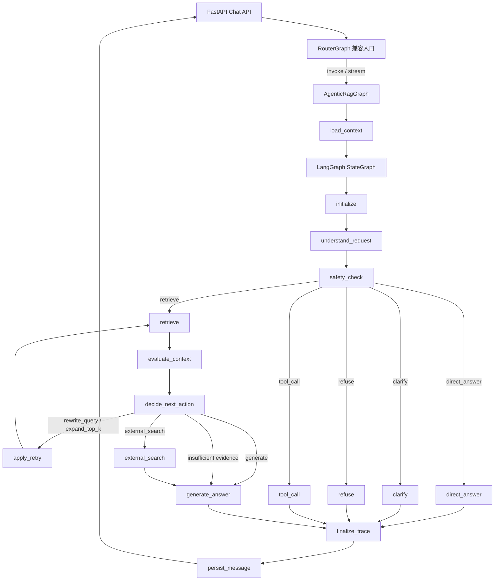
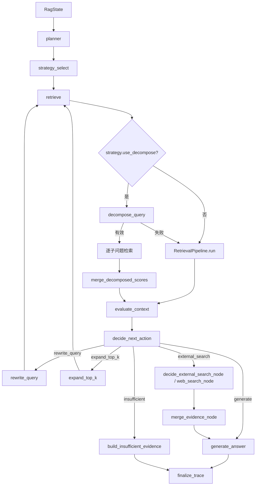

# Agentic RAG 主入口与 RouterGraph 兼容层

本文档描述当前后端聊天主入口的真实结构：`RouterGraph` 现在只保留 API 兼容职责，真正拥有 LangGraph 状态机的是 `AgenticRagGraph`。

## 代码位置

- 兼容入口：`backend/app/agent/router_graph.py`
- 主状态机：`backend/app/rag/agentic_rag_graph.py`
- RAG 证据工作流：`backend/app/rag/rag_evidence_workflow.py`
- EnterpriseRagGraph 兼容包装：`backend/app/rag/enterprise_rag_graph.py`
- RAG schema：`backend/app/schemas/rag.py`
- 非流式入口：`backend/app/router/chat_service.py`
- SSE 流式入口：`backend/app/router/chat.py`

## 当前主链路



## RouterGraph 当前职责

`RouterGraph` 不再维护自己的 `StateGraph`、`GraphState` 或旧多分支路由节点。它当前是面向旧 API 的薄包装器：

| 方法 | 当前行为 |
| --- | --- |
| `invoke(query, user_id, session_id)` | 调用 `AgenticRagGraph.invoke()`，再映射为旧 `RouterResponse` 字段。 |
| `stream(query, user_id, session_id)` | 调用 `AgenticRagGraph.invoke()`，先输出兼容的 `route` SSE 事件，再转发 `state.sse_events`，最后输出 `response` 和 `done`。 |
| `_sse_event(data)` | 把字典序列化成 `data: ...\n\n`。 |

兼容层返回的 `route` 固定为：

```text
agentic_rag
```

旧的 `chat`、`enterprise_knowledge`、`tool_action`、`unsafe_or_system`、`clarify` 顶层 route 不再由 `RouterGraph` 自己分支执行；这些语义已经下沉到 `AgenticRagGraph` 的 `action`、`response_type`、`rag_intent` 和策略配置中。

## AgenticRagGraph 状态机

`AgenticRagGraph` 使用 `RagState` 作为 LangGraph 状态，主要节点如下：

| 节点 | 主要职责 |
| --- | --- |
| `initialize` | 记录 `agentic_graph_initialized` 事件。 |
| `understand_request` | 生成或解析 `AgenticActionDecision`，写入 `intent`、`action`、`needs_retrieval`、`needs_tool`、`needs_clarification`、`safety_risk`、`source_hints`、`required_tools`、`router_confidence`。 |
| `safety_check` | 根据安全风险、澄清需求、检索需求决定进入 `direct_answer`、`clarify`、`refuse`、`tool_call` 或 `retrieve`。 |
| `direct_answer` | 对不需要企业知识库的问题生成直接回答。 |
| `clarify` | 生成需要补充目标、范围或上下文的澄清问题。 |
| `refuse` | 对高风险或破坏性请求返回拒绝。 |
| `tool_call` | 使用 `AgenticToolRunner` 执行受控工具，并生成工具回答。 |
| `retrieve` | 委托 `RagEvidenceWorkflow` 做规划、策略选择和检索。 |
| `evaluate_context` | 评估证据是否足够回答。 |
| `decide_next_action` | 决定生成、重写查询、扩大 topK、外部搜索或证据不足。 |
| `apply_retry` | 执行 `rewrite_query` 或 `expand_top_k` 后回到检索。 |
| `external_search` | 当前在图内记录跳过事件，保留外部搜索扩展点。 |
| `generate_answer` | 证据足够时生成 grounded answer，否则构造证据不足响应。 |
| `finalize_trace` | 记录图完成事件，随后由 workflow 生成最终 `RagResponse`。 |

## RagState 关键字段

`RagState` 定义在 `backend/app/schemas/rag.py`，当前核心字段可以按职责分组理解：

| 分组 | 字段 |
| --- | --- |
| 请求身份 | `request_id`, `debug_id`, `session_id`, `user_id`, `original_query`, `current_query` |
| 路由/行动 | `route`, `rag_intent`, `intent`, `action`, `source_hints`, `router_confidence`, `router_reason` |
| 记忆上下文 | `history`, `memory_summary`, `memory_compressed_turns`, `memory_total_turns`, `long_term_memories`, `memory_context` |
| 工具调用 | `needs_tool`, `required_tools`, `tool_results` |
| RAG 规划与策略 | `plan`, `strategy`, `sub_queries`, `rewritten_queries` |
| 检索与证据 | `retrieval_attempts`, `selected_documents`, `evaluator_result`, `sources` |
| 重试与外部搜索 | `retry_count`, `max_retries`, `next_action`, `external_search_decision`, `web_results`, `evidence_mode` |
| 输出 | `response_type`, `answer`, `warnings`, `error`, `sse_events` |

## RAG evidence workflow 边界

`RagEvidenceWorkflow` 是证据链路的主编排器。`AgenticRagGraph.retrieve_node()`、`evaluate_context_node()`、`decide_next_action_node()`、`apply_retry_node()` 和 `generate_answer_node()` 都委托它完成具体 RAG 工作。



## 策略选择

`StrategyRouter` 根据 `rag_intent` 和 `router_confidence` 选择 `RagStrategyConfig`：

| intent | strategy_name | 关键策略 |
| --- | --- | --- |
| `fact_lookup` | `dense_bm25_rrf` | hybrid 检索，默认不 rerank，`final_top_k=5`。 |
| `semantic_query` | `dense_bm25_rrf_reranker` | hybrid + reranker。 |
| `multi_hop` / `comparison` | `dense_bm25_rrf_reranker_decompose` | 扩大 topK，启用 reranker 和 decompose，`final_top_k=10`。 |
| `procedure` | `dense_bm25_rrf` | 扩大检索规模，默认不 rerank，`final_top_k=8`。 |
| `constrained` | `dense_bm25_rrf_reranker` | 扩大检索规模并启用 reranker。 |
| `follow_up` | `history_rewrite_dense_bm25_rrf` | 启用 query rewrite，默认不 decompose。 |
| 其他 | `conservative_hybrid` | 保守 hybrid 默认策略。 |

当 `router_confidence < 0.65` 且基础策略未启用 reranker 时，策略会升级为 `low_confidence_hybrid_reranker`。

## SSE 输出语义

当前 `RouterGraph.stream()` 输出顺序为：

```text
route 兼容事件
-> AgenticRagGraph / RagEvidenceWorkflow 写入的 sse_events
-> response 兼容事件
-> done 兼容事件
```

典型事件包括：

```json
{"type": "route", "route": "agentic_rag", "rag_intent": "fact_lookup", "confidence": 0.8}
{"type": "rag_plan_created", "stage": "planner", "data": {}}
{"type": "strategy_selected", "stage": "strategy_select", "data": {}}
{"type": "retrieval_started", "stage": "retrieve", "data": {}}
{"type": "retrieval_finished", "stage": "retrieve", "data": {}}
{"type": "response", "content": "..."}
{"type": "done"}
```

## 当前设计要点

1. `RouterGraph` 只负责兼容旧入口，不再拥有业务分支状态机。
2. `AgenticRagGraph` 是单一 Agentic RAG 图所有者，统一处理直接回答、澄清、拒绝、工具调用和检索回答。
3. `RagEvidenceWorkflow` 是证据链路所有者，统一负责 planner、strategy、retrieval、evaluation、retry、external search fallback、generation 和 trace finalization。
4. `EnterpriseRagGraph` 只保留对 `RagEvidenceWorkflow` 的兼容包装，便于旧测试和脚本继续调用。
5. 会话压缩记忆和长期记忆由 `AgenticRagGraph.load_context()` 统一加载。
6. 回答成功且无错误时由 `AgenticRagGraph.persist_message()` 写入会话历史。

## 更新记录

- 2026-05-14：创建 LangGraph RouterGraph 设计文档和 TODO 清单。
- 2026-05-23：按旧 RouterGraph 多分支实现更新可视化图、State 定义、节点职责、非流式和 SSE 流式链路。
- 2026-06-11：同步当前架构：`RouterGraph` 收敛为兼容包装器，`AgenticRagGraph` 成为唯一 LangGraph 状态机，`RagEvidenceWorkflow` 成为 RAG 证据工作流所有者。
